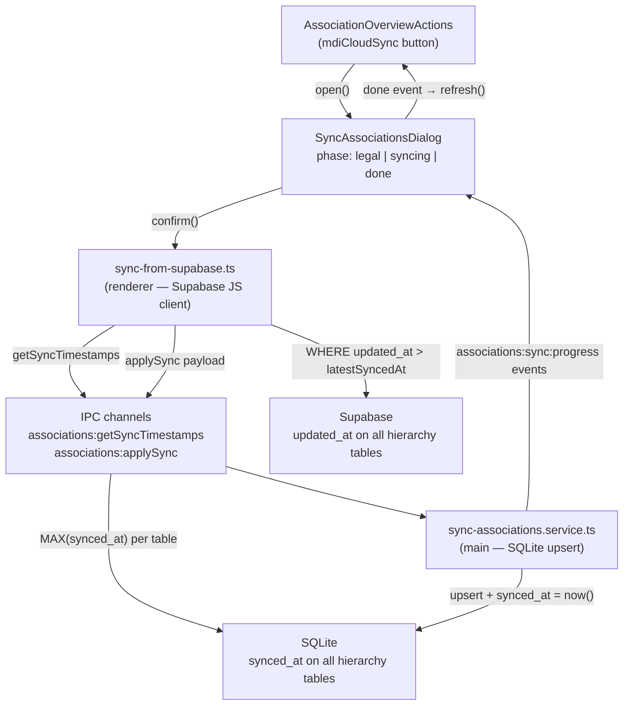

# Architecture

DojoSphere uses two complementary architectures: **Feature-Sliced Design (FSD)** in the renderer and **vertical slices** in the Electron main process. The preload script bridges IPC between them.

## Overview

| Area                | Architecture                                            | Location                                                          |
| ------------------- | ------------------------------------------------------- | ----------------------------------------------------------------- |
| **Renderer**        | [Feature-Sliced Design](https://feature-sliced.design/) | `src/renderer/app/`, `pages/`, `widgets/`, `features/`, `shared/` |
| **Preload**         | IPC bridge                                              | `src/preload/`                                                    |
| **Main (Electron)** | Vertical Slices                                         | `src/main/features/<slice>/`, `shared/`, `app/`                   |

## Renderer (FSD)

- `src/renderer/app/` — composition root (router, plugins, providers)
- `src/renderer/pages/` — route-level components
- `src/renderer/widgets/` — reusable composed UI blocks
- `src/renderer/features/` — business slices (authentication, settings, status, …)
- `src/renderer/shared/` — cross-cutting utilities, API clients, UI primitives

Import rules and slice conventions: `.cursor/rules/architecture-fsd.mdc`.

## Main process (vertical slices)

- `src/main/app/` — bootstrap, IPC registration (`register-ipc.ts`)
- `src/main/features/<slice>/` — one use case per slice (users, sessions, health, logging, diagnostics, …)
- `src/main/shared/` — infrastructure (database, security helpers)
- `src/main/window/` — main-process window setup
- `src/preload/` — IPC bridge to `window.api`

Each main feature slice follows this layout:

```
src/main/features/<slice>/
  ipc/register.ts    # thin IPC adapters
  service/           # use-case orchestration (optional)
  repository/        # SQL access (optional)
  index.ts           # public API
```

Import rules:

- `features → shared`
- `features → features` only via `@main/features/<slice>`
- `shared` must not import features

Details: `.cursor/rules/architecture-vertical-slice.mdc`.

## Security boundaries

- The renderer must not access SQLite directly; all privileged operations go through IPC in the main process.
- Every privileged IPC operation must verify session, user, and permission in the main process.
- The renderer must not make security-critical decisions on its own.

See `.cursor/rules/security-privacy.mdc` for full security guidelines.

## Cloud sync (associations)

The *Sync from cloud* feature lets users download association reference data from Supabase into the local SQLite database. It follows the existing security boundaries: the renderer queries the cloud API, the main process writes to SQLite.

### Flow



### Key design decisions

| Decision | Rationale |
| -------- | --------- |
| Renderer fetches Supabase, main writes SQLite | Matches existing security boundary: renderer owns cloud API, main owns local DB |
| Incremental sync via `updated_at > synced_at` | Avoids re-downloading unchanged rows on subsequent syncs |
| `ON CONFLICT(id) DO UPDATE` upsert | Prevents duplicate rows regardless of sync frequency |
| Per-association progress events (`IpcRenderer.send`) | UI can stream updates without blocking the main process transaction |
| Legal notice dialog before download | Informs users about the network request and data source (required for GDPR transparency) |
| Child tables re-synced with parent | `association_identifiers / addresses / contacts` lack `updated_at`; they are deleted and re-inserted whenever their parent association is synced |

### File locations

| Layer | Path |
| ----- | ---- |
| Renderer — Supabase fetch | `src/renderer/features/associations/sync-associations/service/sync-from-supabase.ts` |
| Renderer — composable | `src/renderer/features/associations/sync-associations/model/use-sync-associations.ts` |
| Renderer — dialog | `src/renderer/features/associations/sync-associations/ui/SyncAssociationsDialog.vue` |
| Main — sync service | `src/main/features/associations/sync/sync-associations.service.ts` |
| Main — IPC handlers | `src/main/features/associations/ipc/register.ts` (`associations:getSyncTimestamps`, `associations:applySync`) |
| SQLite migration | `src/main/shared/database/migrations/V016__associations_add_synced_at.sql` |
| Supabase migration | `supabase/migrations/20260916000000_add_updated_at_to_hierarchy_tables.sql` |
| Schema doc | `docs/database/associations-schema.md#cloud-sync` |
