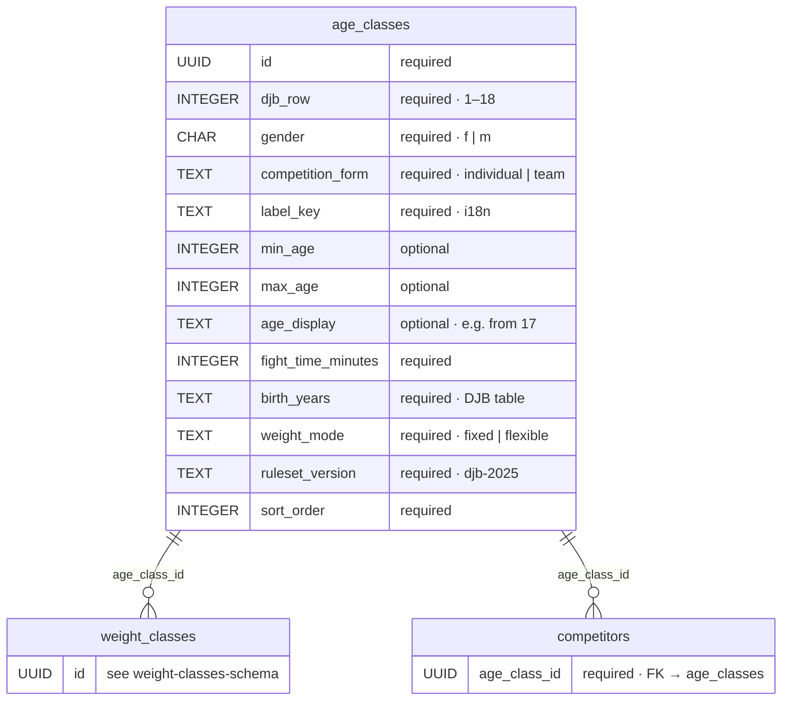
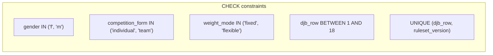

# Age classes — database schema (DJB)

Reference table for age classes per the [German Judo Federation (DJB)](https://www.judobund.de/service/regeln-und-ordnungen/wettkampfinformationen). One row in `age_classes` maps to **exactly one row** in the official document *Age and weight classes (DJB 2025)* ([PDF](https://www.judobund.de/fileadmin/user_upload/judobund.de/Downloads/Regeln_und_Ordnungen/Alters-_und_Gewichtsklassen_2025.pdf)).

Used by `competitors.age_class_id`. Weight classes per row: [weight-classes-schema.md](./weight-classes-schema.md).

**Birth year** (`birth_years`) determines competition eligibility, not biological age.

## DJB reference table 2025

| # | Category | Age | Weight classes | Fight time | Birth years |
| - | -------- | --- | -------------- | ---------- | ----------- |
| 1 | Male youth U11 individual | 8–10 | Weight-near groups (e.g. pools of 5) | 2 min | 15/16/17 |
| 2 | Male youth U13 individual | 10–12 | Weight-near groups (e.g. pools of 5) | 3 min | 13/14/15 |
| 3 | Male youth U15 individual | 12–14 | −34 −37 −40 −43 −46 −50 −55 −60 −66 +66 | 3 min | 11/12/13 |
| 4 | German youth cup U15 team | 12–14 | −40 −46 −55 −66 +66 (≥64) | 3 min | 11/12/13 |
| 5 | Men U18 individual | 15–17 | −46 −50 −55 −60 −66 −73 −81 −90 +90 | 4 min | 08/09/10 |
| 6 | German club team championship U18 team | 14–17 | −50 −55 −60 −66 −73 +73 (≥73) | 4 min | 08/09/10/11 |
| 7 | Men U21 individual | 17–20 | −60 −66 −73 −81 −90 −100 +100 | 4 min | 05/06/07/08 |
| 8 | Men individual from 17 | from 17 | −60 −66 −73 −81 −90 −100 +100 | 4 min | 08 and older |
| 9 | Bundesliga team from 16 | from 16 | −60 −66 −73 −81 −90 −100 +100 | 4 min | 09 and older |
| 10 | Female youth U11 individual | 8–10 | Weight-near groups (e.g. pools of 5) | 2 min | 15/16/17 |
| 11 | Female youth U13 individual | 10–12 | Weight-near groups (e.g. pools of 5) | 3 min | 13/14/15 |
| 12 | Female youth U15 individual | 12–14 | −33 −36 −40 −44 −48 −52 −57 −63 +63 | 3 min | 11/12/13 |
| 13 | German youth cup U15 team | 12–14 | −40 −48 −57 −63 +63 (≥61) | 3 min | 11/12/13 |
| 14 | Women U18 individual | 15–17 | −40 −44 −48 −52 −57 −63 −70 −78 +78 | 4 min | 08/09/10 |
| 15 | German club team championship U18 team | 14–17 | −44 −48 −52 −57 −63 +63 (≥63) | 4 min | 08/09/10/11 |
| 16 | Women U21 individual | 17–20 | −48 −52 −57 −63 −70 −78 +78 | 4 min | 05/06/07/08 |
| 17 | Women individual from 17 | from 17 | −48 −52 −57 −63 −70 −78 +78 | 4 min | 08 and older |
| 18 | Bundesliga team from 16 | from 16 | −48 −52 −57 −63 −70 −78 +78 | 4 min | 08 and older |

\* Minimum weights apply at team championships and team tournaments.

## Entity relationship



**Legend:** `required` = `NOT NULL` · `optional` = nullable.

## Columns (mapped from DJB table)

| DJB column | DB column | DB type | Required | Notes |
| ---------- | --------- | ------- | -------- | ----- |
| (row #) | `djb_row` | INTEGER | yes | 1–18, stable reference to PDF row |
| Category | `label_key` | TEXT | yes | i18n key for category name |
| (derived) | `gender` | CHAR(1) | yes | `m` or `f` |
| (derived) | `competition_form` | TEXT | yes | `individual` or `team` |
| Age | `min_age`, `max_age` | INTEGER | no | numeric bounds where applicable |
| Age “from X” | `age_display` | TEXT | no | `from 17`, `from 16` when DJB uses open lower bound |
| Fight time | `fight_time_minutes` | INTEGER | yes | 2, 3, or 4 |
| Birth years | `birth_years` | TEXT | yes | as in DJB table, e.g. `11/12/13`, `08 and older` |
| Weight classes | `weight_mode` | TEXT | yes | `flexible` (weight-near groups) or `fixed` |
| — | `ruleset_version` | TEXT | yes | e.g. `djb-2025` |
| — | `sort_order` | INTEGER | yes | defaults to `djb_row` |

## Constraints



- **`fight_time_minutes`**: `CHECK (fight_time_minutes IN (2, 3, 4))`
- **Uniqueness**: `UNIQUE (djb_row, ruleset_version)` — one DB row per DJB table row per ruleset

## Seed data — `age_classes` (DJB 2025)

| `djb_row` | `gender` | `competition_form` | `label_key` | `min_age` | `max_age` | `age_display` | `fight_time_minutes` | `birth_years` | `weight_mode` |
| --------- | -------- | ------------------ | ----------- | --------- | --------- | ------------- | -------------------- | ------------- | ------------- |
| 1 | `m` | `individual` | `ageClasses.djb2025.row01` | 8 | 10 | — | 2 | `15/16/17` | `flexible` |
| 2 | `m` | `individual` | `ageClasses.djb2025.row02` | 10 | 12 | — | 3 | `13/14/15` | `flexible` |
| 3 | `m` | `individual` | `ageClasses.djb2025.row03` | 12 | 14 | — | 3 | `11/12/13` | `fixed` |
| 4 | `m` | `team` | `ageClasses.djb2025.row04` | 12 | 14 | — | 3 | `11/12/13` | `fixed` |
| 5 | `m` | `individual` | `ageClasses.djb2025.row05` | 15 | 17 | — | 4 | `08/09/10` | `fixed` |
| 6 | `m` | `team` | `ageClasses.djb2025.row06` | 14 | 17 | — | 4 | `08/09/10/11` | `fixed` |
| 7 | `m` | `individual` | `ageClasses.djb2025.row07` | 17 | 20 | — | 4 | `05/06/07/08` | `fixed` |
| 8 | `m` | `individual` | `ageClasses.djb2025.row08` | 17 | — | `from 17` | 4 | `08 and older` | `fixed` |
| 9 | `m` | `team` | `ageClasses.djb2025.row09` | 16 | — | `from 16` | 4 | `09 and older` | `fixed` |
| 10 | `f` | `individual` | `ageClasses.djb2025.row10` | 8 | 10 | — | 2 | `15/16/17` | `flexible` |
| 11 | `f` | `individual` | `ageClasses.djb2025.row11` | 10 | 12 | — | 3 | `13/14/15` | `flexible` |
| 12 | `f` | `individual` | `ageClasses.djb2025.row12` | 12 | 14 | — | 3 | `11/12/13` | `fixed` |
| 13 | `f` | `team` | `ageClasses.djb2025.row13` | 12 | 14 | — | 3 | `11/12/13` | `fixed` |
| 14 | `f` | `individual` | `ageClasses.djb2025.row14` | 15 | 17 | — | 4 | `08/09/10` | `fixed` |
| 15 | `f` | `team` | `ageClasses.djb2025.row15` | 14 | 17 | — | 4 | `08/09/10/11` | `fixed` |
| 16 | `f` | `individual` | `ageClasses.djb2025.row16` | 17 | 20 | — | 4 | `05/06/07/08` | `fixed` |
| 17 | `f` | `individual` | `ageClasses.djb2025.row17` | 17 | — | `from 17` | 4 | `08 and older` | `fixed` |
| 18 | `f` | `team` | `ageClasses.djb2025.row18` | 16 | — | `from 16` | 4 | `08 and older` | `fixed` |

`sort_order` = `djb_row` for all seeds.

## Target DDL (reference)

```sql
CREATE TABLE age_classes (
  id TEXT PRIMARY KEY,
  djb_row INTEGER NOT NULL CHECK (djb_row BETWEEN 1 AND 18),
  gender TEXT NOT NULL CHECK (gender IN ('f', 'm')),
  competition_form TEXT NOT NULL CHECK (competition_form IN ('individual', 'team')),
  label_key TEXT NOT NULL,
  min_age INTEGER,
  max_age INTEGER,
  age_display TEXT,
  fight_time_minutes INTEGER NOT NULL CHECK (fight_time_minutes IN (2, 3, 4)),
  birth_years TEXT NOT NULL,
  weight_mode TEXT NOT NULL CHECK (weight_mode IN ('fixed', 'flexible')),
  ruleset_version TEXT NOT NULL,
  sort_order INTEGER NOT NULL,
  UNIQUE (djb_row, ruleset_version)
);

CREATE INDEX idx_age_classes_sort_order ON age_classes(sort_order);
CREATE INDEX idx_age_classes_ruleset ON age_classes(ruleset_version);
```

## UI mapping

| UI (`ParticipantForm.ageClass`) | Database |
| ------------------------------- | -------- |
| Selector value | `competitors.age_class_id` → `age_classes.id` |
| Display label | `t(age_classes.label_key)` |
| Weight class selector | `weight_classes` filtered by `age_class_id`; disabled when `weight_mode = 'flexible'` |

For club **individual** tournaments, filter selectors to `competition_form = 'individual'` unless the event is a team competition.

## Ruleset updates

When the DJB publishes a new table (e.g. 2026), add a full new set of 18 rows under a new `ruleset_version`. Do not mutate existing seeds.

## Related

- [weight-classes-schema.md](./weight-classes-schema.md) — weight classes per DJB row
- [participants-schema.md](./participants-schema.md) — `competitors.age_class_id` FK
- [database.md](../database.md) — migrations
