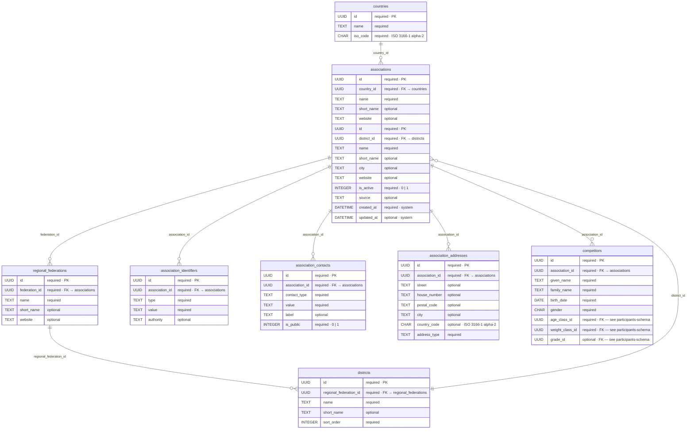
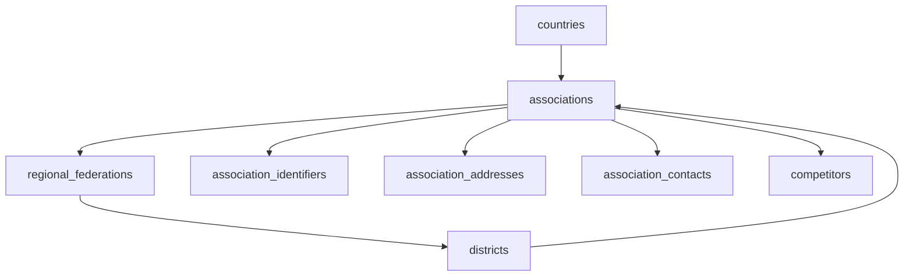
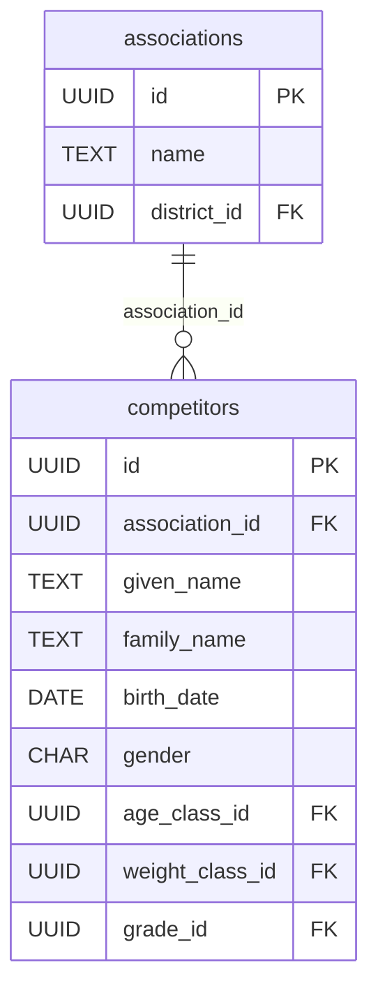

# Associations — database schema

Hierarchy for judo organizations and associations: country → national association → regional association → district → association. Association details (identifiers, addresses, contacts) are normalized into child tables.

Used by `competitors.association_id` — see [participants-schema.md](./participants-schema.md). The UI term is **association** / **Verein**; participant rows reference `associations.id` only (no denormalized association name on `competitors`).

Manual association create/edit does **not** collect Bezirk. Required application fields are association number (Vereinsnummer), headquarters (Hauptsitz), and email — see [Application rules](#application-rules-manual-associations).

Reference and federation data — no competitor personal data in these tables except where contacts are stored for associations (operator responsibility for retention and publication via `is_public`).

## Entity relationship



**Legend:** `required` = `NOT NULL` · `optional` = nullable · `UUID` / `DATETIME` / `CHAR` = semantic type (stored as `TEXT` / ISO 8601 in SQLite).

Full `competitors` definition: [participants-schema.md](./participants-schema.md). Other participant FKs (`age_classes`, `weight_classes`, `grades`) are documented there.

## Hierarchy



## Tables

### `countries`

| Column | DB type | Required | Notes |
| ------ | ------- | -------- | ----- |
| `id` | UUID | yes (PK) | |
| `name` | TEXT | yes | display name |
| `iso_code` | CHAR(2) | yes | ISO 3166-1 alpha-2, unique |
| `synced_at` | DATETIME | no | set by cloud sync — see [Cloud sync](#cloud-sync) |

### `federations`

National federations (e.g. DJB for Germany).

| Column | DB type | Required | Notes |
| ------ | ------- | -------- | ----- |
| `id` | UUID | yes (PK) | |
| `country_id` | UUID | yes | FK → `countries.id` |
| `name` | TEXT | yes | |
| `short_name` | TEXT | no | |
| `website` | TEXT | no | URL |
| `synced_at` | DATETIME | no | set by cloud sync — see [Cloud sync](#cloud-sync) |

### `regional_federations`

State / regional federations under a national association.

| Column | DB type | Required | Notes |
| ------ | ------- | -------- | ----- |
| `id` | UUID | yes (PK) | |
| `federation_id` | UUID | yes | FK → `associations.id` |
| `name` | TEXT | yes | |
| `short_name` | TEXT | no | |
| `website` | TEXT | no | URL |
| `synced_at` | DATETIME | no | set by cloud sync — see [Cloud sync](#cloud-sync) |

### `districts`

Districts (Bezirke) under a regional association. Kept for federation hierarchy and joins; the association create/edit form does **not** collect a Bezirk. Manually created associations use the seeded placeholder district.

| Column | DB type | Required | Notes |
| ------ | ------- | -------- | ----- |
| `id` | UUID | yes (PK) | |
| `regional_federation_id` | UUID | yes | FK → `regional_federations.id` |
| `name` | TEXT | yes | |
| `short_name` | TEXT | no | |
| `sort_order` | INTEGER | yes | UI sort within parent |
| `synced_at` | DATETIME | no | set by cloud sync — see [Cloud sync](#cloud-sync) |

### `associations`

| Column | DB type | Required | Notes |
| ------ | ------- | -------- | ----- |
| `id` | UUID | yes (PK) | referenced by `competitors.association_id` |
| `district_id` | UUID | yes | FK → `districts.id`; manual creates use the placeholder district |
| `name` | TEXT | yes | |
| `short_name` | TEXT | no | |
| `city` | TEXT | no | primary city label (detail in `association_addresses`) |
| `website` | TEXT | no | URL |
| `is_active` | INTEGER | yes | `1` = active, `0` = inactive |
| `source` | TEXT | no | import origin, e.g. `djb-registry`, `manual` |
| `created_at` | DATETIME | yes | system |
| `updated_at` | DATETIME | no | system, set by DB trigger on update |
| `synced_at` | DATETIME | no | set by cloud sync — ISO 8601 timestamp of the last successful Supabase → SQLite upsert; `NULL` for rows that have never been synced (seeded or manually created) — see [Cloud sync](#cloud-sync) |

### `association_identifiers`

External or federation IDs (e.g. association number / Vereinsnummer).

| Column | DB type | Required | Notes |
| ------ | ------- | -------- | ----- |
| `id` | UUID | yes (PK) | |
| `association_id` | UUID | yes | FK → `associations.id` |
| `type` | TEXT | yes | e.g. `djb_association_number` |
| `value` | TEXT | yes | identifier value; unique for `djb_association_number` (see V015) |
| `authority` | TEXT | no | issuing body |

### `association_addresses`

| Column | DB type | Required | Notes |
| ------ | ------- | -------- | ----- |
| `id` | UUID | yes (PK) | |
| `association_id` | UUID | yes | FK → `associations.id` |
| `street` | TEXT | no | required in app for headquarters (`address_type = 'primary'`) |
| `house_number` | TEXT | no | required in app for headquarters |
| `postal_code` | TEXT | no | required in app for headquarters |
| `city` | TEXT | no | required in app for headquarters |
| `country_code` | CHAR(2) | no | ISO 3166-1 alpha-2 |
| `address_type` | TEXT | yes | e.g. `primary` (Hauptsitz), `training`, `billing` |

### `association_contacts`

Association contact data (email, phone, etc.). Use `is_public` for data minimization in audience views.

| Column | DB type | Required | Notes |
| ------ | ------- | -------- | ----- |
| `id` | UUID | yes (PK) | |
| `association_id` | UUID | yes | FK → `associations.id` |
| `contact_type` | TEXT | yes | e.g. `email`, `phone` |
| `value` | TEXT | yes | contact value; email required in app and must contain `@` and `.` |
| `label` | TEXT | no | e.g. `registration`, `general` |
| `is_public` | INTEGER | yes | `1` = may be shown on LAN overview; `0` = internal |

## Application rules (manual associations)

Enforced in the association form and repository (beyond column nullability):

| Rule | Storage | Notes |
| ---- | ------- | ----- |
| Association number (Vereinsnummer) required | `association_identifiers` with `type = 'djb_association_number'` | Unique across associations via `V015__associations_require_unique_association_number.sql` |
| Headquarters (Hauptsitz) required | `association_addresses` with `address_type = 'primary'` | Street, house number, postal code, and city must be non-empty |
| Email required | `association_contacts` with `contact_type = 'email'` | Value must match a simple email shape (`local@domain.tld`: `@` and `.` required) |
| Bezirk not collected | `associations.district_id` | Always set to the seeded placeholder district on create/update |

## Foreign keys

| Child table | Column | Parent | ON DELETE |
| ----------- | ------ | ------ | --------- |
| `federations` | `country_id` | `countries.id` | `RESTRICT` |
| `regional_federations` | `federation_id` | `federations.id` | `RESTRICT` |
| `districts` | `regional_federation_id` | `regional_federations.id` | `RESTRICT` |
| `associations` | `district_id` | `districts.id` | `RESTRICT` |
| `association_identifiers` | `association_id` | `associations.id` | `CASCADE` |
| `association_addresses` | `association_id` | `associations.id` | `CASCADE` |
| `association_contacts` | `association_id` | `associations.id` | `CASCADE` |
| `competitors` | `association_id` | `associations.id` | `RESTRICT` |

## Target DDL (reference)

Migration order: `countries` → `federations` → `regional_federations` → `districts` → `associations` → child tables → recreate `competitors` with `association_id` FK.

```sql
CREATE TABLE countries (
  id TEXT PRIMARY KEY,
  name TEXT NOT NULL,
  iso_code TEXT NOT NULL UNIQUE
);

CREATE TABLE federations (
  id TEXT PRIMARY KEY,
  country_id TEXT NOT NULL REFERENCES countries(id) ON DELETE RESTRICT,
  name TEXT NOT NULL,
  short_name TEXT,
  website TEXT
);

CREATE TABLE regional_federations (
  id TEXT PRIMARY KEY,
  federation_id TEXT NOT NULL REFERENCES federations(id) ON DELETE RESTRICT,
  name TEXT NOT NULL,
  short_name TEXT,
  website TEXT
);

CREATE TABLE districts (
  id TEXT PRIMARY KEY,
  regional_federation_id TEXT NOT NULL
    REFERENCES regional_federations(id) ON DELETE RESTRICT,
  name TEXT NOT NULL,
  short_name TEXT,
  sort_order INTEGER NOT NULL
);

CREATE TABLE associations (
  id TEXT PRIMARY KEY,
  district_id TEXT NOT NULL REFERENCES districts(id) ON DELETE RESTRICT,
  name TEXT NOT NULL,
  short_name TEXT,
  city TEXT,
  website TEXT,
  is_active INTEGER NOT NULL DEFAULT 1 CHECK (is_active IN (0, 1)),
  source TEXT,
  created_at TEXT NOT NULL DEFAULT CURRENT_TIMESTAMP,
  updated_at TEXT
);

CREATE TABLE association_identifiers (
  id TEXT PRIMARY KEY,
  association_id TEXT NOT NULL REFERENCES associations(id) ON DELETE CASCADE,
  type TEXT NOT NULL,
  value TEXT NOT NULL,
  authority TEXT
);

CREATE TABLE association_addresses (
  id TEXT PRIMARY KEY,
  association_id TEXT NOT NULL REFERENCES associations(id) ON DELETE CASCADE,
  street TEXT,
  house_number TEXT,
  postal_code TEXT,
  city TEXT,
  country_code TEXT,
  address_type TEXT NOT NULL
);

CREATE TABLE association_contacts (
  id TEXT PRIMARY KEY,
  association_id TEXT NOT NULL REFERENCES associations(id) ON DELETE CASCADE,
  contact_type TEXT NOT NULL,
  value TEXT NOT NULL,
  label TEXT,
  is_public INTEGER NOT NULL DEFAULT 0 CHECK (is_public IN (0, 1))
);

CREATE INDEX idx_federations_country_id ON federations(country_id);
CREATE INDEX idx_regional_federations_federation_id ON regional_federations(federation_id);
CREATE INDEX idx_districts_regional_federation_id ON districts(regional_federation_id);
CREATE INDEX idx_associations_district_id ON associations(district_id);
CREATE INDEX idx_associations_name ON associations(name);
CREATE INDEX idx_association_identifiers_association_id ON association_identifiers(association_id);
CREATE INDEX idx_association_addresses_association_id ON association_addresses(association_id);
CREATE INDEX idx_association_contacts_association_id ON association_contacts(association_id);

-- V015__associations_require_unique_association_number.sql
CREATE UNIQUE INDEX IF NOT EXISTS idx_association_identifiers_djb_number
  ON association_identifiers (value)
  WHERE type = 'djb_association_number';
```

## Related

| Doc | Relationship |
| --- | ------------ |
| [participants-schema.md](./participants-schema.md) | `competitors` table — full participant columns, FK on `association_id` |
| [grades-schema.md](./grades-schema.md) | `competitors.grade_id` |
| [age-classes-schema.md](./age-classes-schema.md) | `competitors.age_class_id` |
| [weight-classes-schema.md](./weight-classes-schema.md) | `competitors.weight_class_id` |
| [database.md](../database.md) | migrations |

## Participants link

`competitors` is the participants table ([participants-schema.md](./participants-schema.md)). Only `association_id` connects the two domains:



| `competitors` column | Defined in |
| -------------------- | ---------- |
| `association_id` | this schema (`associations.id`) |
| `given_name`, `family_name`, `birth_date`, `gender`, `nationality`, `pass_number`, … | [participants-schema.md](./participants-schema.md) |
| `age_class_id`, `weight_class_id`, `grade_id` | [age-classes](./age-classes-schema.md), [weight-classes](./weight-classes-schema.md), [grades](./grades-schema.md) |

**Migration order:** create and seed the association hierarchy (`countries` … `association_contacts`), then reference tables (`grades`, `age_classes`, `weight_classes`), then create or recreate `competitors` with all foreign keys.

## UI mapping

### Participant form / overview

| UI | Database |
| -- | -------- |
| `ParticipantForm` association selector (label: Verein) | `competitors.association_id` → `associations.id` |
| Association display name | `associations.name` (or `short_name`) |
| Participant overview column “Association” / “Verein” | same join — not stored on `competitors` |
| Association contact email | not on participant form; see association contacts below |

### Association form / overview

| UI | Database |
| -- | -------- |
| Name | `associations.name` |
| Association number (Vereinsnummer, required) | `association_identifiers` (`type = 'djb_association_number'`) |
| Headquarters / Hauptsitz (required) | `association_addresses` (`address_type = 'primary'`) |
| Training venue / billing address | `association_addresses` (`training` / `billing`) |
| Email (required, `@` and `.`) | `association_contacts` (`contact_type = 'email'`) |
| Phone (optional) | `association_contacts` (`contact_type = 'phone'`) |
| Bezirk | not shown; `district_id` stays on the placeholder district |

## Cloud sync

### Overview

The *Sync from cloud* feature downloads association reference data from Supabase into the local SQLite database. It is triggered from the association overview toolbar via the cloud-sync button.

### `synced_at` column

Every association hierarchy table (`countries`, `federations`, `regional_federations`, `districts`, `associations`) has a `synced_at TEXT` column (added in `V016__associations_add_synced_at.sql`). It stores the ISO 8601 UTC timestamp at which the row was last written from Supabase. A `NULL` value means the row has never been synced (seeded locally or created manually).

### Incremental sync strategy

1. **Get local timestamps** — the main process reads `MAX(synced_at)` for each table via IPC (`associations:getSyncTimestamps`).
2. **Filter on Supabase** — the renderer queries Supabase with `updated_at > latestSyncedAt` (or fetches all rows when `latestSyncedAt IS NULL`). This relies on the `updated_at` column that exists on `associations` (from the initial migration) and was added to the other hierarchy tables in `supabase/migrations/20260916000000_add_updated_at_to_hierarchy_tables.sql`.
3. **Upsert locally** — the renderer sends the payload to the main process via IPC (`associations:applySync`). The main process upserts all rows with `INSERT … ON CONFLICT(id) DO UPDATE` and sets `synced_at = datetime('now')`.
4. **Progress streaming** — the main process emits one `associations:sync:progress` event per association back to the renderer while upserts are in flight.

### Duplicate prevention

Because upserts use `ON CONFLICT(id) DO UPDATE`, re-running a sync never creates duplicate rows. Only rows whose `updated_at` post-dates the local `synced_at` are downloaded.

### Child tables

`association_identifiers`, `association_addresses`, and `association_contacts` do not have their own `updated_at` columns. They are always re-synced (delete + insert) for any parent `associations` row that is included in the sync payload.

### Supabase RLS

Hierarchy tables are readable by authenticated users via Row Level Security policies (`SELECT … TO authenticated`). No write access is granted to clients.
