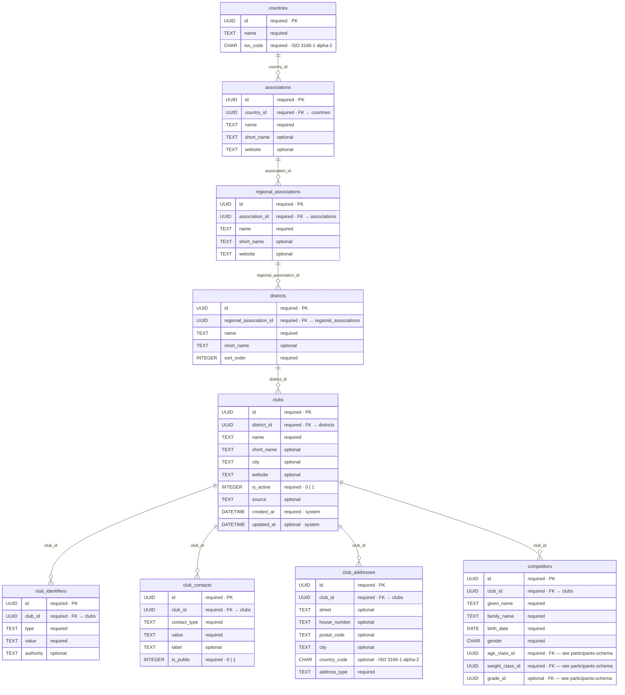
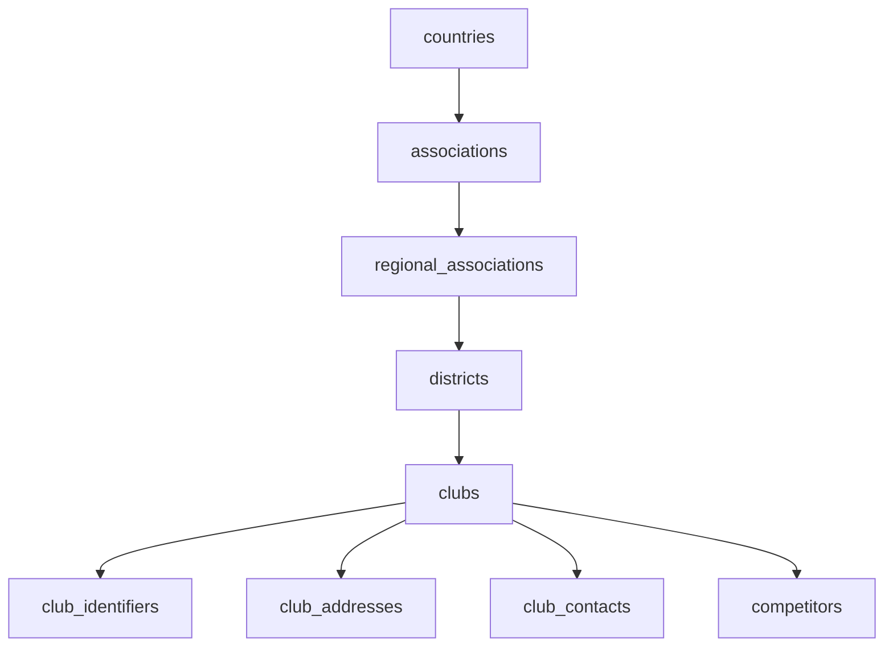
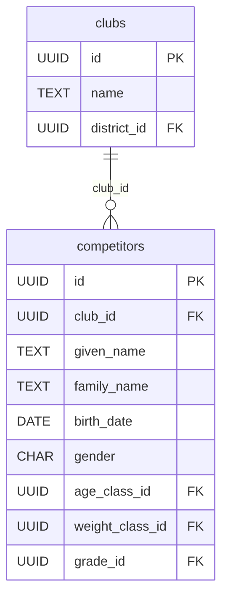

# Clubs — database schema

Hierarchy for judo organizations and clubs: country → national association → regional association → district → club. Club details (identifiers, addresses, contacts) are normalized into child tables.

Used by `competitors.club_id` — see [participants-schema.md](./participants-schema.md). The UI term is **club**; participant rows reference `clubs.id` only (no denormalized club name on `competitors`).

Reference and federation data — no competitor personal data in these tables except where contacts are stored for clubs (operator responsibility for retention and publication via `is_public`).

## Entity relationship



**Legend:** `required` = `NOT NULL` · `optional` = nullable · `UUID` / `DATETIME` / `CHAR` = semantic type (stored as `TEXT` / ISO 8601 in SQLite).

Full `competitors` definition: [participants-schema.md](./participants-schema.md). Other participant FKs (`age_classes`, `weight_classes`, `grades`) are documented there.

## Hierarchy



## Tables

### `countries`

| Column | DB type | Required | Notes |
| ------ | ------- | -------- | ----- |
| `id` | UUID | yes (PK) | |
| `name` | TEXT | yes | display name |
| `iso_code` | CHAR(2) | yes | ISO 3166-1 alpha-2, unique |

### `associations`

National federations (e.g. DJB for Germany).

| Column | DB type | Required | Notes |
| ------ | ------- | -------- | ----- |
| `id` | UUID | yes (PK) | |
| `country_id` | UUID | yes | FK → `countries.id` |
| `name` | TEXT | yes | |
| `short_name` | TEXT | no | |
| `website` | TEXT | no | URL |

### `regional_associations`

State / regional federations under a national association.

| Column | DB type | Required | Notes |
| ------ | ------- | -------- | ----- |
| `id` | UUID | yes (PK) | |
| `association_id` | UUID | yes | FK → `associations.id` |
| `name` | TEXT | yes | |
| `short_name` | TEXT | no | |
| `website` | TEXT | no | URL |

### `districts`

Districts (Bezirke) under a regional association.

| Column | DB type | Required | Notes |
| ------ | ------- | -------- | ----- |
| `id` | UUID | yes (PK) | |
| `regional_association_id` | UUID | yes | FK → `regional_associations.id` |
| `name` | TEXT | yes | |
| `short_name` | TEXT | no | |
| `sort_order` | INTEGER | yes | UI sort within parent |

### `clubs`

| Column | DB type | Required | Notes |
| ------ | ------- | -------- | ----- |
| `id` | UUID | yes (PK) | referenced by `competitors.club_id` |
| `district_id` | UUID | yes | FK → `districts.id` |
| `name` | TEXT | yes | |
| `short_name` | TEXT | no | |
| `city` | TEXT | no | primary city label (detail in `club_addresses`) |
| `website` | TEXT | no | URL |
| `is_active` | INTEGER | yes | `1` = active, `0` = inactive |
| `source` | TEXT | no | import origin, e.g. `djb-registry`, `manual` |
| `created_at` | DATETIME | yes | system |
| `updated_at` | DATETIME | no | system |

### `club_identifiers`

External or federation IDs (e.g. club number).

| Column | DB type | Required | Notes |
| ------ | ------- | -------- | ----- |
| `id` | UUID | yes (PK) | |
| `club_id` | UUID | yes | FK → `clubs.id` |
| `type` | TEXT | yes | e.g. `djb_club_number` |
| `value` | TEXT | yes | identifier value |
| `authority` | TEXT | no | issuing body |

### `club_addresses`

| Column | DB type | Required | Notes |
| ------ | ------- | -------- | ----- |
| `id` | UUID | yes (PK) | |
| `club_id` | UUID | yes | FK → `clubs.id` |
| `street` | TEXT | no | |
| `house_number` | TEXT | no | |
| `postal_code` | TEXT | no | |
| `city` | TEXT | no | |
| `country_code` | CHAR(2) | no | ISO 3166-1 alpha-2 |
| `address_type` | TEXT | yes | e.g. `primary`, `training` |

### `club_contacts`

Club contact data (email, phone, etc.). Use `is_public` for data minimization in audience views.

| Column | DB type | Required | Notes |
| ------ | ------- | -------- | ----- |
| `id` | UUID | yes (PK) | |
| `club_id` | UUID | yes | FK → `clubs.id` |
| `contact_type` | TEXT | yes | e.g. `email`, `phone` |
| `value` | TEXT | yes | contact value |
| `label` | TEXT | no | e.g. `registration`, `general` |
| `is_public` | INTEGER | yes | `1` = may be shown on LAN overview; `0` = internal |

## Foreign keys

| Child table | Column | Parent | ON DELETE |
| ----------- | ------ | ------ | --------- |
| `associations` | `country_id` | `countries.id` | `RESTRICT` |
| `regional_associations` | `association_id` | `associations.id` | `RESTRICT` |
| `districts` | `regional_association_id` | `regional_associations.id` | `RESTRICT` |
| `clubs` | `district_id` | `districts.id` | `RESTRICT` |
| `club_identifiers` | `club_id` | `clubs.id` | `CASCADE` |
| `club_addresses` | `club_id` | `clubs.id` | `CASCADE` |
| `club_contacts` | `club_id` | `clubs.id` | `CASCADE` |
| `competitors` | `club_id` | `clubs.id` | `RESTRICT` |

## Target DDL (reference)

Migration order: `countries` → `associations` → `regional_associations` → `districts` → `clubs` → child tables → recreate `competitors` with `club_id` FK.

```sql
CREATE TABLE countries (
  id TEXT PRIMARY KEY,
  name TEXT NOT NULL,
  iso_code TEXT NOT NULL UNIQUE
);

CREATE TABLE associations (
  id TEXT PRIMARY KEY,
  country_id TEXT NOT NULL REFERENCES countries(id) ON DELETE RESTRICT,
  name TEXT NOT NULL,
  short_name TEXT,
  website TEXT
);

CREATE TABLE regional_associations (
  id TEXT PRIMARY KEY,
  association_id TEXT NOT NULL REFERENCES associations(id) ON DELETE RESTRICT,
  name TEXT NOT NULL,
  short_name TEXT,
  website TEXT
);

CREATE TABLE districts (
  id TEXT PRIMARY KEY,
  regional_association_id TEXT NOT NULL
    REFERENCES regional_associations(id) ON DELETE RESTRICT,
  name TEXT NOT NULL,
  short_name TEXT,
  sort_order INTEGER NOT NULL
);

CREATE TABLE clubs (
  id TEXT PRIMARY KEY,
  district_id TEXT NOT NULL REFERENCES districts(id) ON DELETE RESTRICT,
  name TEXT NOT NULL,
  short_name TEXT,
  city TEXT,
  website TEXT,
  is_active INTEGER NOT NULL DEFAULT 1 CHECK (is_active IN (0, 1)),
  source TEXT,
  created_at TEXT NOT NULL DEFAULT CURRENT_TIMESTAMP,
  updated_at TEXT
);

CREATE TABLE club_identifiers (
  id TEXT PRIMARY KEY,
  club_id TEXT NOT NULL REFERENCES clubs(id) ON DELETE CASCADE,
  type TEXT NOT NULL,
  value TEXT NOT NULL,
  authority TEXT
);

CREATE TABLE club_addresses (
  id TEXT PRIMARY KEY,
  club_id TEXT NOT NULL REFERENCES clubs(id) ON DELETE CASCADE,
  street TEXT,
  house_number TEXT,
  postal_code TEXT,
  city TEXT,
  country_code TEXT,
  address_type TEXT NOT NULL
);

CREATE TABLE club_contacts (
  id TEXT PRIMARY KEY,
  club_id TEXT NOT NULL REFERENCES clubs(id) ON DELETE CASCADE,
  contact_type TEXT NOT NULL,
  value TEXT NOT NULL,
  label TEXT,
  is_public INTEGER NOT NULL DEFAULT 0 CHECK (is_public IN (0, 1))
);

CREATE INDEX idx_associations_country_id ON associations(country_id);
CREATE INDEX idx_regional_associations_association_id ON regional_associations(association_id);
CREATE INDEX idx_districts_regional_association_id ON districts(regional_association_id);
CREATE INDEX idx_clubs_district_id ON clubs(district_id);
CREATE INDEX idx_clubs_name ON clubs(name);
CREATE INDEX idx_club_identifiers_club_id ON club_identifiers(club_id);
CREATE INDEX idx_club_addresses_club_id ON club_addresses(club_id);
CREATE INDEX idx_club_contacts_club_id ON club_contacts(club_id);
```

## Related

| Doc | Relationship |
| --- | ------------ |
| [participants-schema.md](./participants-schema.md) | `competitors` table — full participant columns, FK on `club_id` |
| [grades-schema.md](./grades-schema.md) | `competitors.grade_id` |
| [age-classes-schema.md](./age-classes-schema.md) | `competitors.age_class_id` |
| [weight-classes-schema.md](./weight-classes-schema.md) | `competitors.weight_class_id` |
| [database.md](../database.md) | migrations |

## Participants link

`competitors` is the participants table ([participants-schema.md](./participants-schema.md)). Only `club_id` connects the two domains:



| `competitors` column | Defined in |
| -------------------- | ---------- |
| `club_id` | this schema (`clubs.id`) |
| `given_name`, `family_name`, `birth_date`, `gender`, `nationality`, `pass_number`, … | [participants-schema.md](./participants-schema.md) |
| `age_class_id`, `weight_class_id`, `grade_id` | [age-classes](./age-classes-schema.md), [weight-classes](./weight-classes-schema.md), [grades](./grades-schema.md) |

**Migration order:** create and seed the club hierarchy (`countries` … `club_contacts`), then reference tables (`grades`, `age_classes`, `weight_classes`), then create or recreate `competitors` with all foreign keys.

## UI mapping

| UI | Database |
| -- | -------- |
| `ParticipantForm.club` (selector) | `competitors.club_id` → `clubs.id` |
| Club display name | `clubs.name` (or `short_name`) |
| Club contact email (removed from participant form) | `club_contacts` where `contact_type = 'email'` |

| Club selector label | `clubs.name` joined via `competitors.club_id` |
| Participant overview column “Club” | same join — not stored on `competitors` |

## Related

See [Participants link](#participants-link) above for the full cross-schema table.
