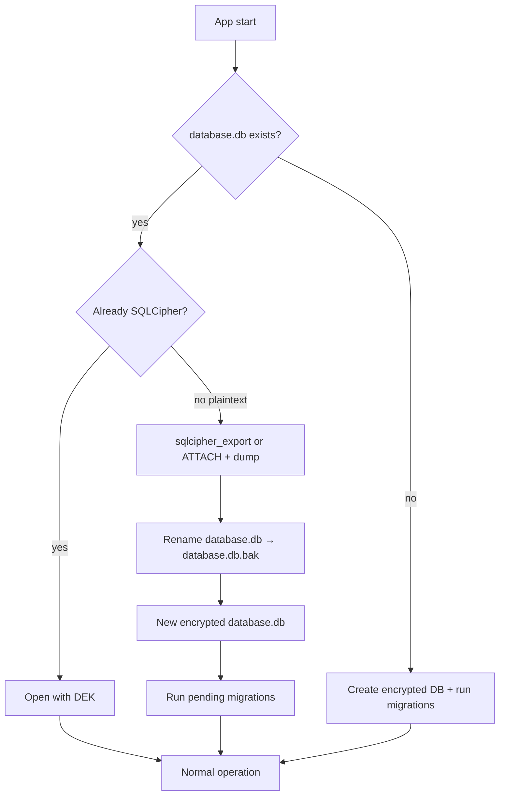

# Encryption at rest — architecture sketch (SQLCipher)

This document sketches how DojoSphere could encrypt the local SQLite database on the tournament director's host. It is **not** an implementation commitment and does **not** claim automatic GDPR compliance.

## Current state

| Layer | Today |
| ----- | ----- |
| Driver | Node.js built-in [`node:sqlite`](https://nodejs.org/api/sqlite.html) (`DatabaseSync`) in `src/main/shared/database/driver.ts` |
| File | `<userData>/database.db` — **plaintext** SQLite |
| Access control | Roles/permissions in main process; renderer via IPC only |
| Secrets in DB | Session/join/access tokens stored as **hashes** only |
| Participant PII | Stored as plain `TEXT` in `competitors` and related tables |

`node:sqlite` uses standard SQLite **without** the SQLCipher extension. There is no `PRAGMA key = …` support today.

## Threat model (local host)

| Scenario | Plaintext DB (today) | SQLCipher + OS keychain |
| -------- | -------------------- | ------------------------ |
| Unauthorised renderer / browser client | Mitigated by IPC + permissions | Same |
| Copy of `database.db` from disk/USB | **Full PII readable** | Ciphertext without key; useless offline |
| Stolen laptop, disk encrypted (BitLocker/FileVault) | Protected by OS | Defense in depth |
| Stolen laptop, disk **not** encrypted | PII exposed | PII still protected if key stays in OS store |
| Malware on host while app is running | Can read via process memory / IPC | Same — encryption at rest does not help runtime |
| Operator forgets backup password | N/A | Recovery policy required (see below) |

Hashing participant fields is **not** an option: names and birth dates must remain readable for tournament operations.

## Recommended approach

**Encrypt the whole database file** with SQLCipher, not individual columns.

Use a **data encryption key (DEK)** for SQLCipher and protect that key with the **OS secret store** via Electron [`safeStorage`](https://www.electronjs.org/docs/latest/api/safe-storage):

```
┌─────────────────────────────────────────────────────────────┐
│ Electron main process                                        │
│                                                              │
│  bootstrap()                                                 │
│    → resolveDatabaseKey()                                    │
│         ├─ read <userData>/database.key (wrapped DEK)        │
│         ├─ safeStorage.decryptString(wrapped) → DEK         │
│         └─ or generate DEK + safeStorage.encryptString()     │
│    → openSqlcipherDatabase(path, DEK)                       │
│         └─ PRAGMA key = 'x''…''';  (SQLCipher)              │
│    → applyPragmas() + runMigrations()                        │
└─────────────────────────────────────────────────────────────┘

Files on disk:
  database.db      — encrypted SQLite (SQLCipher)
  database.key     — wrapped DEK (safeStorage blob, not the raw key)
```

### Why switch drivers?

SQLCipher requires a SQLite build linked against SQLCipher. Practical options for Electron:

| Option | Pros | Cons |
| ------ | ---- | ---- |
| [`@journeyapps/sqlcipher`](https://github.com/journeyapps/node-sqlcipher) | Mature, `better-sqlite3`-like API, SQLCipher | Native module; `electron-rebuild` per Electron version |
| `better-sqlite3` + SQLCipher build | Widely used | Same native rebuild cost |
| Keep `node:sqlite` | No native rebuild | **No SQLCipher** — not viable for file encryption |

The existing `Database` port in `src/main/shared/database/types/database.ts` should stay; only `driver.ts` (and tests) swap implementation.

### Key management rules

1. **Never** store the raw DEK in the renderer, preload, logs, or Supabase.
2. **Never** hard-code a global app password — one key per installation (or per Windows user profile).
3. Wrap the DEK with `safeStorage` (DPAPI on Windows, Keychain on macOS, Secret Service on Linux where available).
4. If `safeStorage.isEncryptionAvailable()` is false, define explicit behaviour: refuse to store PII, or prompt once per session (weaker; document in operator guide).
5. Session tokens remain **hashed** in the DB; do not change that model.

### Bootstrap sequence (target)

```typescript
// Pseudocode — src/main/shared/database/connection.ts

export function initDatabase(): Database {
  if (db) return db

  const dbPath = path.join(app.getPath('userData'), 'database.db')
  const keyPath = path.join(app.getPath('userData'), 'database.key')

  const dek = loadOrCreateDatabaseKey(keyPath) // uses safeStorage
  db = createSqlcipherDatabase(dbPath, dek)

  applyPragmas(db)
  return db
}
```

```typescript
// Pseudocode — src/main/shared/database/driver.ts

export function createSqlcipherDatabase(dbPath: string, dek: Buffer): Database {
  const database = new SqlcipherDatabase(dbPath)
  // SQLCipher 4 defaults; align pragma with sqlcipher version shipped
  database.pragma(`key = "x'${dek.toString('hex')}'"`)
  return adaptToDatabasePort(database)
}
```

Repositories and migrations **do not** change — they already use `@main/shared/database` only.

## Migration from existing plaintext `database.db`

One-time upgrade on first launch after the feature ships:



Implementation notes:

1. Detect plaintext vs encrypted (e.g. header `SQLite format 3` vs failed `PRAGMA cipher_version` / open with key).
2. Use SQLCipher `ATTACH` + `sqlcipher_export` or official migration pattern — **test on copy**; never delete `database.db.bak` until verified.
3. Migrations must not delete user data without a documented decision (existing project rule).
4. Document rollback: restore `.bak` and install previous app version.

## Testing impact

| Area | Change |
| ---- | ------ |
| Unit/integration tests | Keep `:memory:` databases **unencrypted** for speed, or use a fixed test DEK in `createMemoryDatabase()` |
| `initTestDatabase()` | No `safeStorage` in plain Node — mock `loadOrCreateDatabaseKey` or use env `DOJOSPHERE_TEST_DB_KEY` |
| DBCode / VS Code browsing | Requires SQLCipher-aware client + key; document that devs need export tooling or a debug-only unlock |
| CI | No change if tests stay in-memory |

## Operator / recovery

Operators are responsible for deployment security. Document in README or operator guide:

- Enable OS full-disk encryption on the tournament PC.
- Back up `database.db` **and** `database.key` together — losing the key loses the data.
- Optional: future “export encrypted backup” in Settings (password-based backup key derived with Argon2id, separate from daily DEK).
- No claim that the software alone satisfies legal obligations.

## Phased rollout (suggested)

1. **Design** — This document; decision on driver (`@journeyapps/sqlcipher` vs alternatives).
2. **Spike** — Electron rebuild pipeline; open encrypted DB in dev; prove migration script on sample `database.db`.
3. **Core** — `database-key.ts` (safeStorage), new driver, `initDatabase` wiring; feature flag `DOJOSPHERE_DB_ENCRYPTION=1` for gradual enable.
4. **Migration** — Automatic plaintext → encrypted upgrade; audit log entry `database_encrypted`.
5. **Hardening** — Fail closed when `safeStorage` unavailable; remove feature flag; update `docs/database.md` and SECURITY.md.

## What we explicitly do not recommend

- **Field-level hashing** of names, birth dates, or nationality — breaks the product.
- **Reversible “hash”** — that is encryption; name it correctly and use standard primitives.
- **Single app-wide password baked into the binary** — trivially extractable from the MIT-licensed app.
- **Encrypting only the E2E Playwright stub** — already handled; production path is SQLite in main.

## Related code (today)

- Connection: `src/main/shared/database/connection.ts`
- Driver port: `src/main/shared/database/driver.ts`, `types/database.ts`
- Bootstrap: `src/main/app/bootstrap.ts`
- Session hashing (keep): `src/main/features/sessions/repository/sessions.repository.ts`
- Participant schema: `src/main/shared/database/migrations/V008__competitors_create_table.sql`

## References

- [SQLCipher design](https://www.zetetic.net/sqlcipher/design/)
- [Electron safeStorage](https://www.electronjs.org/docs/latest/api/safe-storage)
- [Node.js sqlite (no encryption)](https://nodejs.org/api/sqlite.html)
- Project security rules: `.cursor/rules/security-privacy.mdc`
