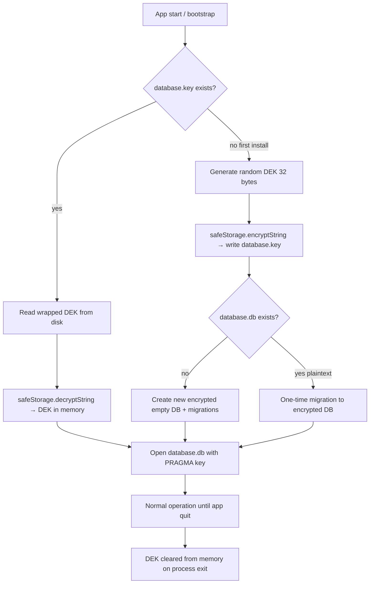
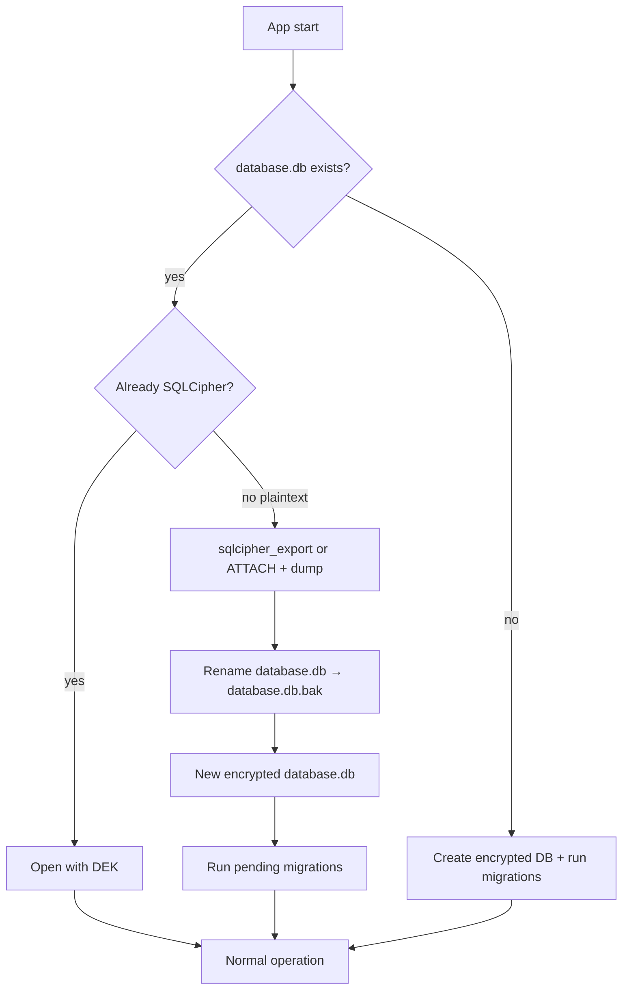

# Encryption at rest — architecture sketch (SQLCipher)

This document sketches how DojoSphere could encrypt the local SQLite database on the tournament director's host. It is **not** an implementation commitment and does **not** claim automatic GDPR compliance.

## Current state

| Layer | Today |
| ----- | ----- |
| Driver | Node.js built-in [`node:sqlite`](https://nodejs.org/api/sqlite.html) (`DatabaseSync`) in `src/main/shared/database/driver.ts` |
| File | `<userData>/database.db` — **plaintext** SQLite |
| Access control | Roles/permissions in main process; renderer via IPC only |
| Secrets in DB | Session/join/access tokens stored as **hashes** only |
| Participant PII | Stored as plain `TEXT` in `competitors` and related tables |

`node:sqlite` uses standard SQLite **without** the SQLCipher extension. There is no `PRAGMA key = …` support today.

## Threat model (local host)

| Scenario | Plaintext DB (today) | SQLCipher + OS keychain |
| -------- | -------------------- | ------------------------ |
| Unauthorised renderer / browser client | Mitigated by IPC + permissions | Same |
| Copy of `database.db` from disk/USB | **Full PII readable** | Ciphertext without key; useless offline |
| Stolen laptop, disk encrypted (BitLocker/FileVault) | Protected by OS | Defense in depth |
| Stolen laptop, disk **not** encrypted | PII exposed | PII still protected if key stays in OS store |
| Malware on host while app is running | Can read via process memory / IPC | Same — encryption at rest does not help runtime |
| Operator forgets backup password | N/A | Recovery policy required (see below) |

Hashing participant fields is **not** an option: names and birth dates must remain readable for tournament operations.

## Recommended approach

**Encrypt the whole database file** with SQLCipher, not individual columns.

Use a **data encryption key (DEK)** for SQLCipher and protect that key with the **OS secret store** via Electron [`safeStorage`](https://www.electronjs.org/docs/latest/api/safe-storage):

```
┌─────────────────────────────────────────────────────────────┐
│ Electron main process                                        │
│                                                              │
│  bootstrap()                                                 │
│    → resolveDatabaseKey()                                    │
│         ├─ read <userData>/database.key (wrapped DEK)        │
│         ├─ safeStorage.decryptString(wrapped) → DEK         │
│         └─ or generate DEK + safeStorage.encryptString()     │
│    → openSqlcipherDatabase(path, DEK)                       │
│         └─ PRAGMA key = 'x''…''';  (SQLCipher)              │
│    → applyPragmas() + runMigrations()                        │
└─────────────────────────────────────────────────────────────┘

Files on disk:
  database.db      — encrypted SQLite (SQLCipher)
  database.key     — wrapped DEK (safeStorage blob, not the raw key)
```

### Why switch drivers?

SQLCipher requires a SQLite build linked against SQLCipher. Practical options for Electron:

| Option | Pros | Cons |
| ------ | ---- | ---- |
| [`@journeyapps/sqlcipher`](https://github.com/journeyapps/node-sqlcipher) | Mature, `better-sqlite3`-like API, SQLCipher | Native module; `electron-rebuild` per Electron version |
| `better-sqlite3` + SQLCipher build | Widely used | Same native rebuild cost |
| Keep `node:sqlite` | No native rebuild | **No SQLCipher** — not viable for file encryption |

The existing `Database` port in `src/main/shared/database/types/database.ts` should stay; only `driver.ts` (and tests) swap implementation.

### Key management rules

1. **Never** store the raw DEK in the renderer, preload, logs, or Supabase.
2. **Never** hard-code a global app password — one key per installation (or per Windows user profile).
3. Wrap the DEK with `safeStorage` (DPAPI on Windows, Keychain on macOS, Secret Service on Linux where available).
4. If `safeStorage.isEncryptionAvailable()` is false, define explicit behaviour: refuse to store PII, or prompt once per session (weaker; document in operator guide).
5. Session tokens remain **hashed** in the DB; do not change that model.

## Key lifecycle (local development vs production)

There is **no separate “production key” in the cloud** and no key shipped inside the app binary. Dev and production use the **same mechanism**; they differ only by **machine and `userData` directory**.

| | Local (`npm run electron:start`) | Production (installed Electron app) |
| --- | --- | --- |
| **Where** | `%APPDATA%/dojosphere/` (Windows) or equivalent | Same — `app.getPath('userData')` on the tournament PC |
| **Key files** | `database.key` + `database.db` on **your** dev machine | Same filenames on the **host** machine |
| **Who generates the key** | First bootstrap on that machine | First bootstrap on that machine |
| **Shared across developers** | No — each PC has its own DEK | No |
| **Shared with Supabase** | No | No |

### Is the key created at startup?

**Every app start** runs `resolveDatabaseKey()` during `bootstrap()` → `initDatabase()`, but that does **not** mean a new key is generated every time.



| Phase | What happens |
| ----- | ------------- |
| **First launch** on a machine | Random DEK generated once → wrapped into `database.key` → used to create or migrate `database.db`. |
| **Every later launch** | Existing `database.key` loaded → OS unwraps DEK → same key opens the same DB. **No rotation** unless you add that feature later. |
| **While the app runs** | DEK lives in main-process memory (needed for SQLCipher). Not sent to renderer or IPC. |
| **After quit** | DEK is gone from RAM; only the wrapped blob remains on disk. |

### What `safeStorage` binds to

The file `database.key` is **not** the raw DEK. It is a blob that only `safeStorage.decryptString()` can unwrap on the **same OS user account** on the **same machine** (DPAPI / Keychain / Secret Service).

Implications:

- Copying only `database.db` to another computer → **unreadable** without that machine’s `database.key` and OS context.
- Copying `database.db` **and** `database.key` to another PC → still **usually fails** (unwrap fails on a different machine/user).
- Reinstalling the app in the same Windows user profile → typically **still works** (same `userData`, same OS key store).
- New Windows user on the same PC → **new** `userData` path → new installation → new DEK.

### Local dev vs “productive” tournament night

| Situation | Behaviour |
| --------- | --------- |
| Developer laptop | Own `database.db` / `database.key` under dev `userData`; fictional test data. |
| Club PC with installed build | Independent key pair; real tournament data stays on that host. |
| CI / Vitest | No Electron `safeStorage` — use `:memory:` DB or fixed test DEK via env (see Testing impact). |
| Playwright browser-only | No SQLite at all — unrelated to SQLCipher. |

**There is no automatic key sync** between dev and production. That is intentional: cloud optional sync must not upload the DEK (see project security rules).

### Bootstrap sequence (target)

```typescript
// Pseudocode — src/main/shared/database/connection.ts

export function initDatabase(): Database {
  if (db) return db

  const dbPath = path.join(app.getPath('userData'), 'database.db')
  const keyPath = path.join(app.getPath('userData'), 'database.key')

  const dek = loadOrCreateDatabaseKey(keyPath) // uses safeStorage
  db = createSqlcipherDatabase(dbPath, dek)

  applyPragmas(db)
  return db
}
```

```typescript
// Pseudocode — src/main/shared/database/driver.ts

export function createSqlcipherDatabase(dbPath: string, dek: Buffer): Database {
  const database = new SqlcipherDatabase(dbPath)
  // SQLCipher 4 defaults; align pragma with sqlcipher version shipped
  database.pragma(`key = "x'${dek.toString('hex')}'"`)
  return adaptToDatabasePort(database)
}
```

Repositories and migrations **do not** change — they already use `@main/shared/database` only.

## Performance

For DojoSphere’s scale (small club tournaments, tens to low hundreds of participants, single host), SQLCipher overhead is **expected to be negligible** for normal UI operations.

| Operation | Typical impact |
| --------- | ---------------- |
| App start (unwrap key + open DB) | +5–30 ms once per session |
| `getCompetitors()` / single-row read | ~5–15 % slower vs plaintext; often sub-ms total |
| INSERT/UPDATE one participant | ~10–25 % slower; still imperceptible at this volume |
| One-time plaintext → encrypted migration | Seconds once; depends on existing DB size |
| Large full-table scans | Most noticeable case; irrelevant until data grows far beyond a local tournament |

Why it stays fast enough here:

- SQLCipher encrypts **pages** (4–16 KB), not every JavaScript property access.
- Queries already touch few pages for small tables.
- WAL mode (`pragmas.ts`) should remain enabled.
- Bottlenecks are unlikely to be crypto before IPC, Vue rendering, or disk I/O on older club hardware.

What would hurt performance (and is out of scope):

- Per-field encrypt/decrypt in application code.
- Disabling WAL or running huge unindexed scans on every navigation.

Optional hardening later: a small main-process benchmark in CI (e.g. 200 seeded competitors, list + insert) to catch driver regressions — not because users would feel latency.

## Migration from existing plaintext `database.db`

One-time upgrade on first launch after the feature ships:



Implementation notes:

1. Detect plaintext vs encrypted (e.g. header `SQLite format 3` vs failed `PRAGMA cipher_version` / open with key).
2. Use SQLCipher `ATTACH` + `sqlcipher_export` or official migration pattern — **test on copy**; never delete `database.db.bak` until verified.
3. Migrations must not delete user data without a documented decision (existing project rule).
4. Document rollback: restore `.bak` and install previous app version.

## Testing impact

SQLCipher affects **main-process Vitest tests only**. Renderer unit tests and Playwright E2E do not open SQLite.

### Unaffected (no changes)

| Suite | Path / pattern | Reason |
| ----- | -------------- | ------ |
| Renderer unit tests | `src/renderer/**/*.test.ts` | `window.api` mocks only |
| Playwright E2E | `**/*.e2e.spec.ts` | Browser-only stub in `e2e-api.ts` |
| Storybook | `**/*.stories.ts` | API stubs |
| Preload tests | `src/preload/preload.test.ts` | IPC wiring only |

### Affected (main process)

| Suite | How DB is opened today | After encryption |
| ----- | ---------------------- | ---------------- |
| Feature / IPC / repository tests | `initTestDatabase()` → `initDatabase()` on temp `userData` | Needs test key path (see below) |
| Database unit tests | `createMemoryDatabase()` (`:memory:`) | Stay **unencrypted** for speed |
| `bootstrap.test.ts` | Real bootstrap + logging | May need key mock if bootstrap calls `initDatabase()` |

Roughly **15+ test files** use `initTestDatabase()` (users, competitors, sessions, authorization, audit, health). **Four** database tests use `createMemoryDatabase()` directly.

### Recommended test strategy

Use **two paths** in production code, selected by environment — not duplicate business logic:

```
                    ┌─────────────────────────┐
                    │   resolveDatabaseKey()   │
                    └───────────┬─────────────┘
                                │
              ┌─────────────────┴─────────────────┐
              │                                   │
    process.env.VITEST === 'true'          Electron app
    or DOJOSPHERE_TEST_DB_KEY set          safeStorage path
              │                                   │
              ▼                                   ▼
    Fixed DEK from env / test helper    loadOrCreateDatabaseKey()
    (no database.key file required)     (real database.key + OS wrap)
```

**Why not call real `safeStorage` in Vitest?**

- `src/main/test/setup.ts` mocks `electron` with `app` only — **no `safeStorage`** today.
- CI runs plain Node + Vitest, not a full Electron shell.
- OS keychain behaviour is non-deterministic across runners.

**Preferred approach:** In `resolveDatabaseKey()`, when `process.env.VITEST === 'true'` (Vitest sets this) or `DOJOSPHERE_TEST_DB_KEY` is set, return a **fixed 32-byte test DEK** (hex). Do **not** write `database.key` in tests unless explicitly testing key persistence.

`createMemoryDatabase()` should **skip SQLCipher** entirely (`:memory:` + optional fixed key pragma) so `runner.test.ts`, `transactions.test.ts`, etc. stay fast and simple.

### Implementation checklist

When implementing encryption, touch these files:

| File | Action |
| ---- | ------ |
| `src/main/shared/database/database-key.ts` | **New** — `loadOrCreateDatabaseKey()`, test bypass branch |
| `src/main/shared/database/connection.ts` | Wire key resolution before `createSqlcipherDatabase()` |
| `src/main/shared/database/driver.ts` | SQLCipher driver + `createMemoryDatabase()` stays unencrypted |
| `src/main/test/electron-mock.ts` | Optional: add `safeStorage` mock if any test asserts wrap/unwrap |
| `src/main/test/database.ts` | Document that `initTestDatabase()` relies on test DEK; no change if env bypass is in `database-key.ts` |
| `src/main/test/setup.ts` | Only if exporting `safeStorage` on electron mock |
| `vitest.config.ts` | Optional: `env: { DOJOSPHERE_TEST_DB_KEY: '…' }` for explicit fixed key |
| `package.json` / CI workflow | `electron-rebuild` for native SQLCipher module on main test job |
| `docs/database.md` | Link + note that DBCode needs key for encrypted dev DBs |

Repository and IPC test files (`competitors.repository.test.ts`, `register.test.ts`, …) should need **no edits** if `initTestDatabase()` keeps working via the test DEK branch.

### Optional `safeStorage` mock (integration-style tests only)

Add to `electron-mock.ts` only when testing key **file** round-trip:

```typescript
// Pseudocode — src/main/test/electron-mock.ts
export const safeStorage = {
  isEncryptionAvailable: vi.fn(() => true),
  encryptString: vi.fn((value: string) => Buffer.from(`test-wrap:${value}`)),
  decryptString: vi.fn((buffer: Buffer) =>
    buffer.toString().replace(/^test-wrap:/, '')
  )
}
```

And extend `vi.mock('electron', …)` in `setup.ts` to export `safeStorage`. Use this for **dedicated** `database-key.test.ts`, not for every repository test.

### New tests to add

| Test file | Covers |
| --------- | ------ |
| `src/main/shared/database/database-key.test.ts` | Test DEK bypass under `VITEST`; mock `safeStorage` create/load |
| `src/main/shared/database/connection.test.ts` | Extend — encrypted file open with test DEK |
| `src/main/shared/database/migrate-plaintext.test.ts` | One-time plaintext → SQLCipher migration on temp files |

Do **not** run migration tests inside every `initTestDatabase()` call — too slow and brittle.

### CI and native modules

| Topic | Note |
| ----- | ---- |
| SQLCipher driver | Native addon — must build on CI (same as Electron packaging) |
| Test runtime | Vitest `main` project runs in Node; driver must load for `initTestDatabase()` file DBs |
| In-memory tests | No native file I/O; still need loadable `.node` binary |
| Coverage | Unchanged — `src/main/test/**` already excluded in `vitest.config.ts` |

### Developer workflow (local)

| Task | Encrypted dev DB |
| ---- | ---------------- |
| `npm test` | Uses test DEK / `:memory:` — **not** your `%APPDATA%/dojosphere` DB |
| `npm run electron:start` | Real `database.key` + encrypted `database.db` under `userData` |
| DBCode / SQLite GUI | Cannot open encrypted file without key export tooling (document separately) |
| Deleting test artefacts | `closeTestDatabase()` already removes temp `userData` dir |

### Performance in tests

- `:memory:` unencrypted — no measurable change expected.
- File-based `initTestDatabase()` with SQLCipher — small per-suite overhead; acceptable for ~15 files.
- Avoid encrypting in-memory DBs unless a test explicitly asserts cipher pragmas.

### Summary

| Question | Answer |
| -------- | ------ |
| Break renderer / Playwright tests? | **No** |
| Break main repository tests? | **Only without** test DEK bypass or `safeStorage` mock |
| Change every repository test file? | **No** — central change in `database-key.ts` + driver |
| Slower CI? | Slightly, if file DB + SQLCipher; negligible with in-memory strategy |

## Operator / recovery

Operators are responsible for deployment security. Document in README or operator guide:

- Enable OS full-disk encryption on the tournament PC.
- Back up `database.db` **and** `database.key` together — losing the key loses the data.
- Optional: future “export encrypted backup” in Settings (password-based backup key derived with Argon2id, separate from daily DEK).
- No claim that the software alone satisfies legal obligations.

## Phased rollout (suggested)

1. **Design** — This document; decision on driver (`@journeyapps/sqlcipher` vs alternatives).
2. **Spike** — Electron rebuild pipeline; open encrypted DB in dev; prove migration script on sample `database.db`.
3. **Core** — `database-key.ts` (safeStorage), new driver, `initDatabase` wiring; feature flag `DOJOSPHERE_DB_ENCRYPTION=1` for gradual enable.
4. **Migration** — Automatic plaintext → encrypted upgrade; audit log entry `database_encrypted`.
5. **Hardening** — Fail closed when `safeStorage` unavailable; remove feature flag; update `docs/database.md` and SECURITY.md.

## What we explicitly do not recommend

- **Field-level hashing** of names, birth dates, or nationality — breaks the product.
- **Reversible “hash”** — that is encryption; name it correctly and use standard primitives.
- **Single app-wide password baked into the binary** — trivially extractable from the MIT-licensed app.
- **Encrypting only the E2E Playwright stub** — already handled; production path is SQLite in main.

## Related code (today)

- Connection: `src/main/shared/database/connection.ts`
- Driver port: `src/main/shared/database/driver.ts`, `types/database.ts`
- Bootstrap: `src/main/app/bootstrap.ts`
- Session hashing (keep): `src/main/features/sessions/repository/sessions.repository.ts`
- Participant schema: `src/main/shared/database/migrations/V008__competitors_create_table.sql`

## References

- [SQLCipher design](https://www.zetetic.net/sqlcipher/design/)
- [Electron safeStorage](https://www.electronjs.org/docs/latest/api/safe-storage)
- [Node.js sqlite (no encryption)](https://nodejs.org/api/sqlite.html)
- Project security rules: `.cursor/rules/security-privacy.mdc`
