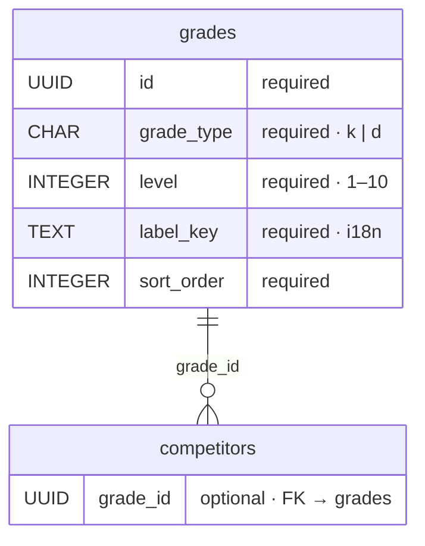
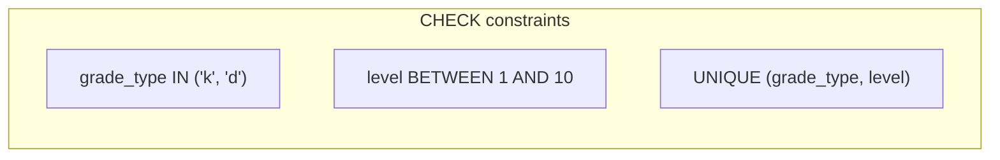

# Grades — database schema

Reference table for judo belt grades: **Kyu** (student ranks) and **Dan** (master ranks). Used by `competitors.grade_id` and selectable in the participant form.

Grades are seeded reference data (not user-editable in v1). Display labels are resolved via i18n `label_key` — no personal data in this table.

## Entity relationship



**Legend:** `required` = `NOT NULL` · `optional` = nullable · `CHAR` / `UUID` = semantic type (stored as `TEXT` in SQLite).

**Type codes:** `k` = Kyu · `d` = Dan (aligned with compact codes such as `f` / `m` / `d` for gender).

**Level semantics:**

| `grade_type` | `level` | Meaning |
| ------------ | ------- | ------- |
| `k` | 10 … 1 | 10. Kyu (lowest) → 1. Kyu (highest Kyu) |
| `d` | 1 … 10 | 1. Dan (Shodan) → 10. Dan |

`sort_order` runs from lowest to highest rank (10. Kyu first, 10. Dan last) for dropdowns and lists.

## Columns

| Column       | DB type   | Required | Notes |
| ------------ | --------- | -------- | ----- |
| `id`         | UUID      | yes (PK) | stable seed UUID per row |
| `grade_type` | CHAR(1)   | yes      | `k` (Kyu) or `d` (Dan) |
| `level`      | INTEGER   | yes      | rank number within type (see table above) |
| `label_key`  | TEXT      | yes      | i18n key, e.g. `grades.k.3`, `grades.d.1` |
| `sort_order` | INTEGER   | yes      | ascending sort for UI |

## Constraints



- **`grade_type`**: `CHECK (grade_type IN ('k', 'd'))`
- **`level`**: `CHECK (level BETWEEN 1 AND 10)`
- **Uniqueness**: `UNIQUE (grade_type, level)` — one row per Kyu/Dan step
- **Index**: `idx_grades_sort_order` on `sort_order` for ordered lookups

## Seed data (reference)

| `grade_type` | `level` | `label_key`   | `sort_order` | Display (via i18n) |
| ------------ | ------- | ------------- | ------------ | ---------------------- |
| `k`          | 10      | `grades.k.10` | 1            | 10. Kyu |
| `k`          | 9       | `grades.k.9`  | 2            | 9. Kyu |
| `k`          | 8       | `grades.k.8`  | 3            | 8. Kyu |
| `k`          | 7       | `grades.k.7`  | 4            | 7. Kyu |
| `k`          | 6       | `grades.k.6`  | 5            | 6. Kyu |
| `k`          | 5       | `grades.k.5`  | 6            | 5. Kyu |
| `k`          | 4       | `grades.k.4`  | 7            | 4. Kyu |
| `k`          | 3       | `grades.k.3`  | 8            | 3. Kyu |
| `k`          | 2       | `grades.k.2`  | 9            | 2. Kyu |
| `k`          | 1       | `grades.k.1`  | 10           | 1. Kyu |
| `d`          | 1       | `grades.d.1`  | 11           | 1. Dan |
| `d`          | 2       | `grades.d.2`  | 12           | 2. Dan |
| `d`          | 3       | `grades.d.3`  | 13           | 3. Dan |
| `d`          | 4       | `grades.d.4`  | 14           | 4. Dan |
| `d`          | 5       | `grades.d.5`  | 15           | 5. Dan |
| `d`          | 6       | `grades.d.6`  | 16           | 6. Dan |
| `d`          | 7       | `grades.d.7`  | 17           | 7. Dan |
| `d`          | 8       | `grades.d.8`  | 18           | 8. Dan |
| `d`          | 9       | `grades.d.9`  | 19           | 9. Dan |
| `d`          | 10      | `grades.d.10` | 20           | 10. Dan |

Seed UUIDs should be fixed in the migration so `grade_id` references remain stable across installs.

## Target DDL (reference)

```sql
CREATE TABLE grades (
  id TEXT PRIMARY KEY,
  grade_type TEXT NOT NULL CHECK (grade_type IN ('k', 'd')),
  level INTEGER NOT NULL CHECK (level BETWEEN 1 AND 10),
  label_key TEXT NOT NULL,
  sort_order INTEGER NOT NULL,
  UNIQUE (grade_type, level)
);

CREATE INDEX idx_grades_sort_order ON grades(sort_order);

-- Example seed row (full seed in migration):
INSERT INTO grades (id, grade_type, level, label_key, sort_order) VALUES
  ('a1000000-0000-4000-8000-000000000003', 'k', 3, 'grades.k.3', 8),
  ('a1000000-0000-4000-8000-000000000011', 'd', 1, 'grades.d.1', 11);
```

## UI mapping

| UI (`ParticipantForm.grade`) | Database |
| ---------------------------- | -------- |
| Selector value               | `competitors.grade_id` → `grades.id` |
| Display label                | `t(grades.label_key)` from joined row |

## Related

- [participants-schema.md](./participants-schema.md) — `competitors.grade_id` FK
- [database.md](../database.md) — migrations and SQLite conventions
