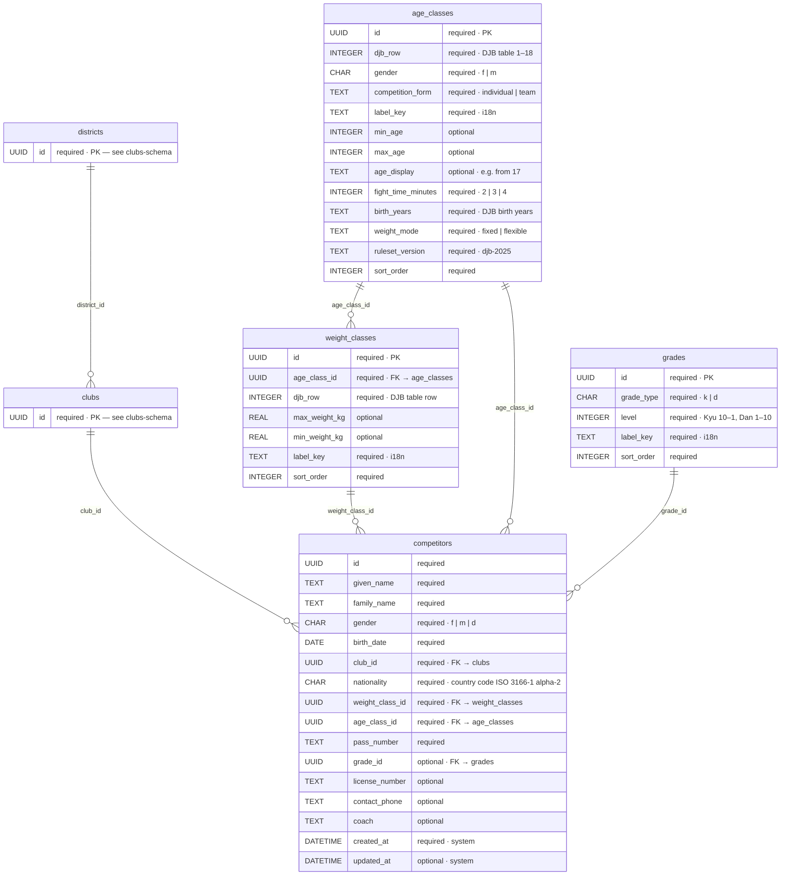
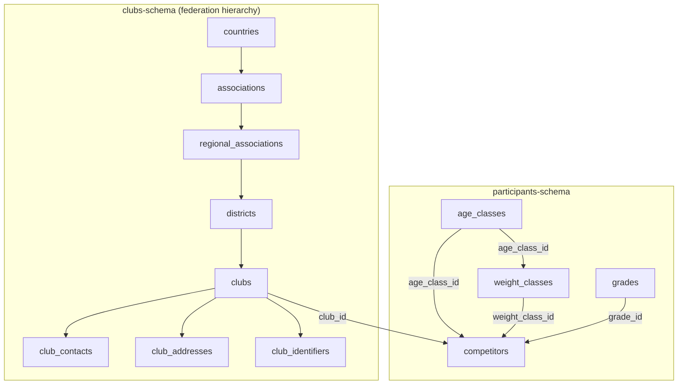

# Participants (competitors) — database schema

Target schema for tournament participants. The UI uses the term **participant**; the SQLite table remains **`competitors`** to match the existing main-process slice (`src/main/features/competitors/`).

Personal data is stored locally on the host (`<userData>/database.db`). Operators are responsible for legal basis, retention, and access control in their deployment.

## Entity relationship (target state)

Participant data lives on `competitors`. Club affiliation is a foreign key into the [club hierarchy](./clubs-schema.md) (`countries` → `associations` → `regional_associations` → `districts` → `clubs`).



**Legend:** `required` = `NOT NULL` · `optional` = nullable · `DATE` / `DATETIME` / `UUID` = semantic type (stored as ISO 8601 or UUID `TEXT` in SQLite).

Club and federation tables (`countries` through `club_contacts`) are defined in [clubs-schema.md](./clubs-schema.md).

## Relationships



| Column | References | ON DELETE | Notes |
| ------ | ---------- | --------- | ----- |
| `competitors.club_id` | `clubs.id` | `RESTRICT` | required; club must exist and `clubs.is_active = 1` at registration (application rule) |
| `competitors.age_class_id` | `age_classes.id` | `RESTRICT` | required |
| `competitors.weight_class_id` | `weight_classes.id` | `RESTRICT` | required; must belong to selected age class (see below) |
| `competitors.grade_id` | `grades.id` | `SET NULL` | optional |

**Cross-table rule:** `competitors.weight_class_id` must reference a `weight_classes` row whose `age_class_id` equals `competitors.age_class_id`. Enforced in the application layer (or via trigger). When `age_classes.weight_mode = 'flexible'`, `weight_class_id` may point to a placeholder row or remain unset per tournament rules — document at implementation time.

Reference table definitions:

| Reference table | Doc |
| --------------- | --- |
| Clubs (federation hierarchy) | [clubs-schema.md](./clubs-schema.md) |
| Grades (Kyu/Dan) | [grades-schema.md](./grades-schema.md) |
| Age classes (DJB) | [age-classes-schema.md](./age-classes-schema.md) |
| Weight classes (DJB) | [weight-classes-schema.md](./weight-classes-schema.md) |

Participants are managed as a flat list on the host for now. A future `tournaments` table and `tournament_competitors` link table can scope entries per event without changing column semantics.

## Field mapping (UI → database)

| UI field (`ParticipantForm`) | Column              | DB type  | Required | Notes |
| ---------------------------- | ------------------- | -------- | -------- | ----- |
| `id`                         | `id`                | UUID     | yes      | primary key |
| `givenName`                  | `given_name`        | TEXT     | yes      | |
| `familyName`                 | `family_name`       | TEXT     | yes      | |
| `gender`                     | `gender`            | CHAR(1)  | yes      | UI labels → DB codes: `female`→`f`, `male`→`m`, `diverse`→`d` |
| `birthDate`                  | `birth_date`        | DATE     | yes      | `YYYY-MM-DD` |
| `club`                       | `club_id`           | UUID     | yes      | FK → [clubs](./clubs-schema.md) |
| `nationality`                | `nationality`       | CHAR(2)  | yes      | country code, ISO 3166-1 alpha-2 (e.g. `DE`) |
| `weightClass`                | `weight_class_id`   | UUID     | yes      | FK → [weight_classes](./weight-classes-schema.md) |
| `ageClass`                   | `age_class_id`      | UUID     | yes      | FK → [age_classes](./age-classes-schema.md) |
| `passNumber`                 | `pass_number`       | TEXT     | yes      | |
| `grade`                      | `grade_id`          | UUID     | no       | optional FK → [grades](./grades-schema.md) |
| `licenseNumber`              | `license_number`    | TEXT     | no       | optional |
| `contactPhone`               | `contact_phone`     | TEXT     | no       | optional |
| `coach`                      | `coach`             | TEXT     | no       | optional |
| —                            | `created_at`        | DATETIME | yes      | system, ISO 8601 timestamp |
| —                            | `updated_at`        | DATETIME | no       | system, set on update |

Club contact email is **not** stored on `competitors`; it belongs to `club_contacts` on the selected club (see [clubs-schema.md](./clubs-schema.md)).

### Resolving club data for participants

| Display need | Source |
| ------------ | ------ |
| Club name in overview / form | `clubs.name` or `clubs.short_name` via `competitors.club_id` |
| District / regional context | `clubs` → `districts` → `regional_associations` (see [clubs-schema.md](./clubs-schema.md)) |
| Club email | `club_contacts` where `club_id` matches and `contact_type = 'email'` |
| Federation club number | `club_identifiers` where `type = 'djb_club_number'` (example) |

Example lookup (reference only):

```sql
SELECT
  c.id,
  c.given_name,
  c.family_name,
  cl.name AS club_name,
  d.name AS district_name
FROM competitors c
JOIN clubs cl ON cl.id = c.club_id
JOIN districts d ON d.id = cl.district_id
WHERE c.id = ?;
```

## Required fields — rationale

| Field | Why required |
| ----- | ------------ |
| `given_name`, `family_name` | Identity on start lists, mat calls, and results. |
| `gender` | Category assignment (`f`, `m`, `d`). |
| `birth_date` | Age-class verification; cannot be inferred reliably. |
| `club_id` | Club affiliation; name and contacts resolved via [clubs](./clubs-schema.md) (`clubs` → `club_contacts`, etc.). |
| `nationality` | Federation requirement; country code for pass validation. |
| `weight_class_id` | Core tournament grouping; every fight is weight-based. |
| `age_class_id` | Core tournament grouping alongside weight. |
| `pass_number` | Judo pass number — standard identifier at local events. |
| `created_at` | Audit trail for when the record was created. |

## Optional fields — rationale

| Field | Why optional |
| ----- | ------------ |
| `grade_id` | Kyu/Dan grade; not always available or needed at registration. |
| `license_number` | Not required at every small club event. |
| `contact_phone` | Participant contact — collected only when needed (data minimization). |
| `coach` | Useful for mat-side communication; not mandatory for draw/scoring. |
| `updated_at` | Set only after the first update. |

## Constraints

SQLite stores all text columns without a native `VARCHAR(n)` limit. Length and format rules are enforced with `CHECK` constraints in `V008__competitors_create_table.sql`. The same limits are defined in `src/renderer/shared/domain/competitor-field-limits.ts` for the participant form.

| Column | Limit | Notes |
| ------ | ----- | ----- |
| `given_name`, `family_name` | 1–80 chars | Trimmed length |
| `birth_date` | 10 chars | `YYYY-MM-DD` (`GLOB '????-??-??'`) |
| `nationality` | 2 chars | ISO 3166-1 alpha-2 letters |
| `pass_number` | 1–32 chars | Letters, digits, `-`, `/` (no fixed DJB format) |
| `license_number` | 1–32 chars | Same character set as `pass_number`, optional |
| `contact_phone` | ≤ 32 chars | Optional; format validated in the app |
| `coach` | 1–80 chars | Optional; trimmed length |

### Pass number validation

The [DJB Passordnung](https://www.judobund.de/fileadmin/user_upload/judobund.de/Downloads/Regeln_und_Ordnungen/WIP_20241012_DJB_Passordnung_Final.pdf) requires a **Lizenznummer** on the digital JudoPass but does **not** publish a fixed format (length, prefix, or checksum). Numbers are assigned centrally in DokuMe. Legacy paper passes used varying alphanumeric values.

DojoSphere therefore validates pragmatically: non-empty, max. 32 characters, printable identifier characters (`0-9`, `A-Z`, `a-z`, `-`, `/`). This does **not** verify pass validity against the DJB — only plausibility for local registration. The separate optional field `license_number` holds the **Wettkampflizenznummer**, which is also not format-specified publicly.


- **`gender`**: `CHECK (gender IN ('f', 'm', 'd'))`
- **`birth_date`**: calendar date `YYYY-MM-DD` (validated in application layer; SQLite has no native `DATE` type).
- **`club_id`**: `FOREIGN KEY (club_id) REFERENCES clubs(id) ON DELETE RESTRICT`
- **`age_class_id`**: `FOREIGN KEY (age_class_id) REFERENCES age_classes(id) ON DELETE RESTRICT`
- **`weight_class_id`**: `FOREIGN KEY (weight_class_id) REFERENCES weight_classes(id) ON DELETE RESTRICT`
- **`grade_id`**: `FOREIGN KEY (grade_id) REFERENCES grades(id) ON DELETE SET NULL`
- **`nationality`**: country code, ISO 3166-1 alpha-2 (e.g. `DE`, `AT`); validated in application layer.
- **`created_at`**, **`updated_at`**: ISO 8601 timestamps (e.g. `2026-06-29T14:30:00.000Z`); `updated_at` nullable.
- **Indexes** (recommended): `idx_competitors_family_name`, `idx_competitors_club_id`, `idx_competitors_weight_class_id`, `idx_competitors_age_class_id`, `idx_competitors_grade_id`.

## Target DDL (reference)

Implemented in `V008__competitors_create_table.sql`. Create and seed `grades`, `age_classes`, `weight_classes`, and the [club hierarchy](./clubs-schema.md) **before** creating `competitors` (migration order: V004 → V007, then V008).

```sql
CREATE TABLE competitors (
  id TEXT PRIMARY KEY,
  given_name TEXT NOT NULL,
  family_name TEXT NOT NULL,
  gender TEXT NOT NULL CHECK (gender IN ('f', 'm', 'd')),
  birth_date TEXT NOT NULL,
  club_id TEXT NOT NULL
    REFERENCES clubs(id) ON DELETE RESTRICT,
  nationality TEXT NOT NULL,
  weight_class_id TEXT NOT NULL
    REFERENCES weight_classes(id) ON DELETE RESTRICT,
  age_class_id TEXT NOT NULL
    REFERENCES age_classes(id) ON DELETE RESTRICT,
  pass_number TEXT NOT NULL,
  grade_id TEXT
    REFERENCES grades(id) ON DELETE SET NULL,
  license_number TEXT,
  contact_phone TEXT,
  coach TEXT,
  created_at TEXT NOT NULL DEFAULT CURRENT_TIMESTAMP,
  updated_at TEXT
);

CREATE INDEX idx_competitors_family_name ON competitors(family_name);
CREATE INDEX idx_competitors_club_id ON competitors(club_id);
CREATE INDEX idx_competitors_weight_class_id ON competitors(weight_class_id);
CREATE INDEX idx_competitors_age_class_id ON competitors(age_class_id);
CREATE INDEX idx_competitors_grade_id ON competitors(grade_id);
```

## Related code

| Layer | Location |
| ----- | -------- |
| Form (renderer) | `src/renderer/features/competitors/save-participant/` |
| Overview (renderer) | `src/renderer/features/competitors/get-participant-overview/` |
| Repository (main) | `src/main/features/competitors/repository/competitors.repository.ts` |
| Migration | `src/main/shared/database/migrations/V008__competitors_create_table.sql` |

## Related schemas

| Doc | Relationship |
| --- | ------------ |
| [clubs-schema.md](./clubs-schema.md) | `competitors.club_id` → `clubs.id`; club name and contacts |
| [grades-schema.md](./grades-schema.md) | `competitors.grade_id` |
| [age-classes-schema.md](./age-classes-schema.md) | `competitors.age_class_id` |
| [weight-classes-schema.md](./weight-classes-schema.md) | `competitors.weight_class_id` |
