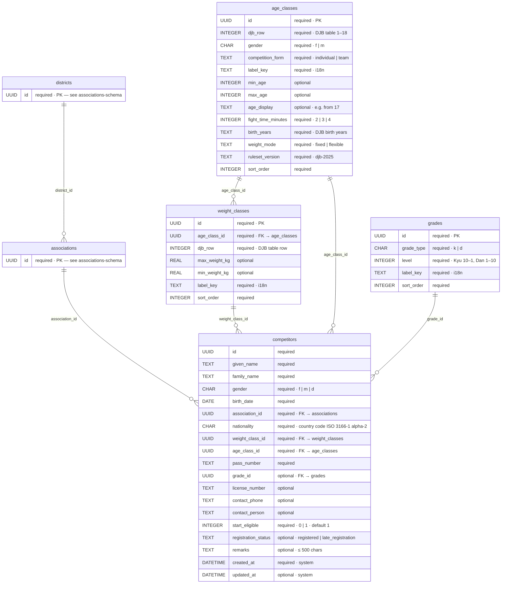
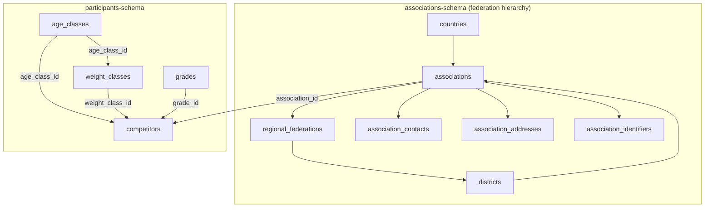
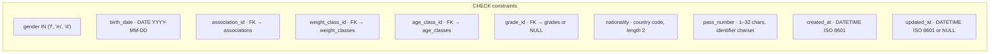

# Participants (competitors) — database schema

Target schema for tournament participants. The UI uses the term **participant**; the SQLite table remains **`competitors`** to match the existing main-process slice (`src/main/features/competitors/`).

Personal data is stored locally on the host (`<userData>/database.db`). Operators are responsible for legal basis, retention, and access control in their deployment.

## Entity relationship (target state)

Participant data lives on `competitors`. Association affiliation is a foreign key into the [association hierarchy](./associations-schema.md) (`countries` → `federations` → `regional_federations` → `districts` → `associations`).


```mermaid
erDiagram
  districts ||--o{ associations : "district_id"
  associations ||--o{ competitors : "association_id"
  weight_classes ||--o{ competitors : "weight_class_id"
  age_classes ||--o{ competitors : "age_class_id"
  grades ||--o{ competitors : "grade_id"
  age_classes ||--o{ weight_classes : "age_class_id"
  associations {
    UUID id "required · PK — see associations-schema"
  }
  districts {
    UUID id "required · PK — see associations-schema"
  }
  weight_classes {
    UUID id "required · PK"
    UUID age_class_id "required · FK → age_classes"
    INTEGER djb_row "required · DJB table row"
    REAL max_weight_kg "optional"
    REAL min_weight_kg "optional"
    TEXT label_key "required · i18n"
    INTEGER sort_order "required"
  }
  age_classes {
    UUID id "required · PK"
    INTEGER djb_row "required · DJB table 1–18"
    CHAR gender "required · f | m"
    TEXT competition_form "required · individual | team"
    TEXT label_key "required · i18n"
    INTEGER min_age "optional"
    INTEGER max_age "optional"
    TEXT age_display "optional · e.g. from 17"
    INTEGER fight_time_minutes "required · 2 | 3 | 4"
    TEXT birth_years "required · DJB birth years"
    TEXT weight_mode "required · fixed | flexible"
    TEXT ruleset_version "required · djb-2025"
    INTEGER sort_order "required"
  }
  grades {
    UUID id "required · PK"
    CHAR grade_type "required · k | d"
    INTEGER level "required · Kyu 10–1, Dan 1–10"
    TEXT label_key "required · i18n"
    INTEGER sort_order "required"
  }
  competitors {
    UUID id "required"
    TEXT given_name "required"
    TEXT family_name "required"
    CHAR gender "required · f | m | d"
    DATE birth_date "required"
    UUID association_id "required · FK → associations"
    CHAR nationality "required · country code ISO 3166-1 alpha-2"
    UUID weight_class_id "required · FK → weight_classes"
    UUID age_class_id "required · FK → age_classes"
    TEXT pass_number "required"
    UUID grade_id "optional · FK → grades"
    TEXT license_number "optional"
    TEXT contact_phone "optional"
    TEXT contact_person "optional"
    INTEGER start_eligible "required · 0 | 1 · default 1"
    TEXT registration_status "optional · registered | late_registration"
    TEXT remarks "optional · ≤ 500 chars"
    DATETIME created_at "required · system"
    DATETIME updated_at "optional · system"
  }
```

**Legend:** `required` = `NOT NULL` · `optional` = nullable · `DATE` / `DATETIME` / `UUID` = semantic type (stored as ISO 8601 or UUID `TEXT` in SQLite).

Association and federation tables (`countries` through `association_contacts`) are defined in [associations-schema.md](./associations-schema.md).

## Relationships


```mermaid
flowchart TB
  subgraph associations_schema["associations-schema (federation hierarchy)"]
    countries --> associations
    associations --> regional_federations
    regional_federations --> districts
    districts --> associations
    associations --> association_contacts
    associations --> association_addresses
    associations --> association_identifiers
  end
  subgraph participants_schema["participants-schema"]
    associations -->|association_id| competitors
    age_classes -->|age_class_id| competitors
    weight_classes -->|weight_class_id| competitors
    grades -->|grade_id| competitors
    age_classes -->|age_class_id| weight_classes
  end
```

| Column | References | ON DELETE | Notes |
| ------ | ---------- | --------- | ----- |
| `competitors.association_id` | `associations.id` | `RESTRICT` | required; association must exist and `associations.is_active = 1` (SQLite trigger) |
| `competitors.age_class_id` | `age_classes.id` | `RESTRICT` | required |
| `competitors.weight_class_id` | `weight_classes.id` | `RESTRICT` | required; must belong to selected age class (see below) |
| `competitors.grade_id` | `grades.id` | `SET NULL` | optional |

**Cross-table rule:** `competitors.weight_class_id` must reference a `weight_classes` row whose `age_class_id` equals `competitors.age_class_id`. Enforced by SQLite triggers `competitors_validate_weight_class_*`. When `age_classes.weight_mode = 'flexible'`, `weight_class_id` may point to a placeholder row or remain unset per tournament rules — document at implementation time.

Reference table definitions:

| Reference table | Doc |
| --------------- | --- |
| Associations (federation hierarchy) | [associations-schema.md](./associations-schema.md) |
| Grades (Kyu/Dan) | [grades-schema.md](./grades-schema.md) |
| Age classes (DJB) | [age-classes-schema.md](./age-classes-schema.md) |
| Weight classes (DJB) | [weight-classes-schema.md](./weight-classes-schema.md) |

Participants are managed as a flat list on the host for now. A future `tournaments` table and `tournament_competitors` link table can scope entries per event without changing column semantics.

## Field mapping (UI → database)

| UI field (`ParticipantForm`) | Column              | DB type  | Required | Notes |
| ---------------------------- | ------------------- | -------- | -------- | ----- |
| `id`                         | `id`                | UUID     | yes      | primary key |
| `givenName`                  | `given_name`        | TEXT     | yes      | |
| `familyName`                 | `family_name`       | TEXT     | yes      | |
| `gender`                     | `gender`            | CHAR(1)  | yes      | UI labels → DB codes: `female`→`f`, `male`→`m`, `diverse`→`d` |
| `birthDate`                  | `birth_date`        | DATE     | yes      | `YYYY-MM-DD` |
| `association`                       | `association_id`           | UUID     | yes      | FK → [associations](./associations-schema.md) |
| `nationality`                | `nationality`       | CHAR(2)  | yes      | country code, ISO 3166-1 alpha-2 (e.g. `DE`) |
| `weightClass`                | `weight_class_id`   | UUID     | yes      | FK → [weight_classes](./weight-classes-schema.md) |
| `ageClass`                   | `age_class_id`      | UUID     | yes      | FK → [age_classes](./age-classes-schema.md) |
| `passNumber`                 | `pass_number`       | TEXT     | yes      | |
| `grade`                      | `grade_id`          | UUID     | no       | optional FK → [grades](./grades-schema.md) |
| `licenseNumber`              | `license_number`    | TEXT     | no       | optional |
| `contactPhone`               | `contact_phone`     | TEXT     | no       | optional |
| `contactPerson`              | `contact_person`    | TEXT     | no       | optional |
| `startEligible`              | `start_eligible`    | INTEGER  | yes      | `0`/`1`, default `1`; UI checkbox |
| `registrationStatus`         | `registration_status` | TEXT   | no       | code → UI label: `registered`→„gemeldet“, `late_registration`→„Nachmeldung“ |
| `remarks`                    | `remarks`           | TEXT     | no       | optional free text, ≤ 500 chars |
| —                            | `created_at`        | DATETIME | yes      | system, ISO 8601 timestamp |
| —                            | `updated_at`        | DATETIME | no       | system, set by DB trigger on update |

Association contact email is **not** stored on `competitors`; it belongs to `association_contacts` on the selected association (see [associations-schema.md](./associations-schema.md)).

### Resolving association data for participants

| Display need | Source |
| ------------ | ------ |
| Association name in overview / form | `associations.name` or `associations.short_name` via `competitors.association_id` |
| District / regional context | `associations` → `districts` → `regional_federations` (see [associations-schema.md](./associations-schema.md)) |
| Association email | `association_contacts` where `association_id` matches and `contact_type = 'email'` |
| Federation association number | `association_identifiers` where `type = 'djb_association_number'` (example) |

Example lookup (reference only):

```sql
SELECT
  c.id,
  c.given_name,
  c.family_name,
  cl.name AS association_name,
  d.name AS district_name
FROM competitors c
JOIN associations cl ON cl.id = c.association_id
JOIN districts d ON d.id = cl.district_id
WHERE c.id = ?;
```

## Required fields — rationale

| Field | Why required |
| ----- | ------------ |
| `given_name`, `family_name` | Identity on start lists, mat calls, and results. |
| `gender` | Category assignment (`f`, `m`, `d`). |
| `birth_date` | Age-class verification; cannot be inferred reliably. |
| `association_id` | Association affiliation; name and contacts resolved via [associations](./associations-schema.md) (`associations` → `association_contacts`, etc.). |
| `nationality` | Federation requirement; country code for pass validation. |
| `weight_class_id` | Core tournament grouping; every fight is weight-based. |
| `age_class_id` | Core tournament grouping alongside weight. |
| `pass_number` | Judo pass number — standard identifier at local events. |
| `created_at` | Audit trail for when the record was created. |

## Optional fields — rationale

| Field | Why optional |
| ----- | ------------ |
| `grade_id` | Kyu/Dan grade; not always available or needed at registration. |
| `license_number` | Not required at every small association event. |
| `contact_phone` | Participant contact — collected only when needed (data minimization). |
| `contact_person` | Useful for mat-side communication; not mandatory for draw/scoring. |
| `registration_status` | Distinguishes regular vs. late registration; not always tracked at small events. |
| `remarks` | Free-text notes (e.g. import annotations); optional and length-limited. |
| `updated_at` | Set only after the first update (SQLite trigger `competitors_set_updated_at`). |

## Constraints

SQLite stores all text columns without a native `VARCHAR(n)` limit. Length and format rules are enforced with `CHECK` constraints. Most columns are defined in `V008__competitors_create_table.sql`; the import fields `start_eligible`, `registration_status`, and `remarks` are added later in `V010__competitors_import_fields.sql`. The same limits are defined in `src/renderer/shared/domain/competitor-field-limits.ts` for the participant form.

| Column | Limit | Notes |
| ------ | ----- | ----- |
| `given_name`, `family_name` | 1–80 chars | Trimmed length |
| `birth_date` | 10 chars | `YYYY-MM-DD` (`GLOB '????-??-??'`) |
| `nationality` | 2 chars | ISO 3166-1 alpha-2 letters |
| `pass_number` | 1–32 chars | Letters, digits, `-`, `/` (no fixed DJB format) |
| `license_number` | 1–32 chars | Same character set as `pass_number`, optional |
| `contact_phone` | ≤ 32 chars | Optional; format validated in the app |
| `contact_person` | 1–80 chars | Optional; trimmed length |
| `start_eligible` | `0` or `1` | `CHECK (start_eligible IN (0, 1))`, default `1` |
| `registration_status` | code set | `CHECK (... IN ('registered', 'late_registration'))` or NULL |
| `remarks` | ≤ 500 chars | `CHECK (remarks IS NULL OR length(remarks) <= 500)` |

### Pass number validation

The [DJB Passordnung](https://www.judobund.de/fileadmin/user_upload/judobund.de/Downloads/Regeln_und_Ordnungen/WIP_20241012_DJB_Passordnung_Final.pdf) requires a **Lizenznummer** on the digital JudoPass but does **not** publish a fixed format (length, prefix, or checksum). Numbers are assigned centrally in DokuMe. Legacy paper passes used varying alphanumeric values.

DojoSphere therefore validates pragmatically: non-empty, max. 32 characters, printable identifier characters (`0-9`, `A-Z`, `a-z`, `-`, `/`). This does **not** verify pass validity against the DJB — only plausibility for local registration. The separate optional field `license_number` holds the **Wettkampflizenznummer**, which is also not format-specified publicly.


```mermaid
flowchart LR
  subgraph checks["CHECK constraints"]
    G["gender IN ('f', 'm', 'd')"]
    BD["birth_date · DATE YYYY-MM-DD"]
    CID["association_id · FK → associations"]
    WCID["weight_class_id · FK → weight_classes"]
    ACID["age_class_id · FK → age_classes"]
    GID["grade_id · FK → grades or NULL"]
    NAT["nationality · country code, length 2"]
    PN["pass_number · 1–32 chars, identifier charset"]
    CA["created_at · DATETIME ISO 8601"]
    UA["updated_at · DATETIME ISO 8601 or NULL"]
  end
```

- **`gender`**: `CHECK (gender IN ('f', 'm', 'd'))`
- **`birth_date`**: calendar date `YYYY-MM-DD` (validated in application layer; SQLite has no native `DATE` type).
- **`association_id`**: `FOREIGN KEY (association_id) REFERENCES associations(id) ON DELETE RESTRICT`
- **`age_class_id`**: `FOREIGN KEY (age_class_id) REFERENCES age_classes(id) ON DELETE RESTRICT`
- **`weight_class_id`**: `FOREIGN KEY (weight_class_id) REFERENCES weight_classes(id) ON DELETE RESTRICT`
- **`grade_id`**: `FOREIGN KEY (grade_id) REFERENCES grades(id) ON DELETE SET NULL`
- **`nationality`**: country code, ISO 3166-1 alpha-2 (e.g. `DE`, `AT`); validated in application layer.
- **`created_at`**, **`updated_at`**: ISO 8601 timestamps (e.g. `2026-06-29T14:30:00.000Z`); `updated_at` nullable.
- **Indexes** (recommended): `idx_competitors_family_name`, `idx_competitors_association_id`, `idx_competitors_weight_class_id`, `idx_competitors_age_class_id`, `idx_competitors_grade_id`.

## Target DDL (reference)

Base table implemented in `V008__competitors_create_table.sql`. Create and seed `grades`, `age_classes`, `weight_classes`, and the [association hierarchy](./associations-schema.md) **before** creating `competitors` (migration order: V004 → V007, then V008). `V009__competitors_allow_optional_weight_class.sql` makes `weight_class_id` optional, and `V010__competitors_import_fields.sql` adds `start_eligible`, `registration_status`, and `remarks` via `ALTER TABLE` (and repairs the triggers V009 dropped). The consolidated DDL below shows the resulting shape after all migrations.

```sql
CREATE TABLE competitors (
  id TEXT PRIMARY KEY,
  given_name TEXT NOT NULL,
  family_name TEXT NOT NULL,
  gender TEXT NOT NULL CHECK (gender IN ('f', 'm', 'd')),
  birth_date TEXT NOT NULL,
  association_id TEXT NOT NULL
    REFERENCES associations(id) ON DELETE RESTRICT,
  nationality TEXT NOT NULL,
  weight_class_id TEXT
    REFERENCES weight_classes(id) ON DELETE RESTRICT,
  age_class_id TEXT NOT NULL
    REFERENCES age_classes(id) ON DELETE RESTRICT,
  pass_number TEXT NOT NULL,
  grade_id TEXT
    REFERENCES grades(id) ON DELETE SET NULL,
  license_number TEXT,
  contact_phone TEXT,
  contact_person TEXT,
  start_eligible INTEGER NOT NULL DEFAULT 1
    CHECK (start_eligible IN (0, 1)),
  registration_status TEXT
    CHECK (
      registration_status IS NULL
      OR registration_status IN ('registered', 'late_registration')
    ),
  remarks TEXT
    CHECK (remarks IS NULL OR length(remarks) <= 500),
  created_at TEXT NOT NULL DEFAULT CURRENT_TIMESTAMP,
  updated_at TEXT
);

CREATE INDEX idx_competitors_family_name ON competitors(family_name);
CREATE INDEX idx_competitors_association_id ON competitors(association_id);
CREATE INDEX idx_competitors_weight_class_id ON competitors(weight_class_id);
CREATE INDEX idx_competitors_age_class_id ON competitors(age_class_id);
CREATE INDEX idx_competitors_grade_id ON competitors(grade_id);
```

## Related code

| Layer | Location |
| ----- | -------- |
| Form (renderer) | `src/renderer/features/competitors/save-participant/` |
| Overview (renderer) | `src/renderer/features/competitors/get-participant-overview/` |
| Repository (main) | `src/main/features/competitors/repository/competitors.repository.ts` |
| Migration | `src/main/shared/database/migrations/V008__competitors_create_table.sql`, `V009__competitors_allow_optional_weight_class.sql`, `V010__competitors_import_fields.sql` |

## Related schemas

| Doc | Relationship |
| --- | ------------ |
| [associations-schema.md](./associations-schema.md) | `competitors.association_id` → `associations.id`; association name and contacts |
| [grades-schema.md](./grades-schema.md) | `competitors.grade_id` |
| [age-classes-schema.md](./age-classes-schema.md) | `competitors.age_class_id` |
| [weight-classes-schema.md](./weight-classes-schema.md) | `competitors.weight_class_id` |
