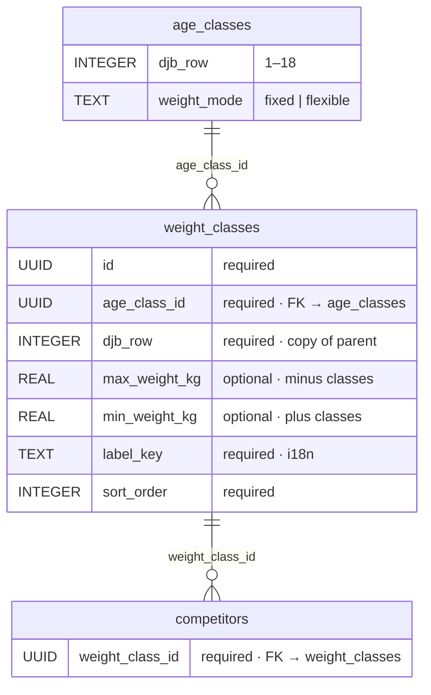

# Weight classes — database schema (DJB)

Reference table for weight classes per the [German Judo Federation (DJB)](https://www.judobund.de/service/regeln-und-ordnungen/wettkampfinformationen). Each row belongs to one [age class](./age-classes-schema.md) row (`djb_row` 1–18) and reproduces the **Weight classes** column of the official *Age and weight classes (DJB 2025)* table.

Used by `competitors.weight_class_id`.

Rows with `age_classes.weight_mode = 'flexible'` (DJB rows 1, 2, 10, 11) have **no** entries in `weight_classes`.

## Entity relationship



**Legend:** `required` = `NOT NULL` · `optional` = nullable.

| Pattern (DJB) | `max_weight_kg` | `min_weight_kg` | Example |
| ------------- | --------------- | --------------- | ------- |
| −X kg | X | — | −60 kg |
| +X kg | — | X | +66 kg |
| +X kg (≥Y) | — | Y | +66 kg (≥64) — team minimum stored in `min_weight_kg` |

## Columns

| Column | DB type | Required | Notes |
| ------ | ------- | -------- | ----- |
| `id` | UUID | yes (PK) | stable seed UUID |
| `age_class_id` | UUID | yes | → `age_classes.id` |
| `djb_row` | INTEGER | yes | parent DJB table row (denormalized for traceability) |
| `max_weight_kg` | REAL | no | upper limit (− classes) |
| `min_weight_kg` | REAL | no | lower limit (+ classes; team minimum when DJB shows ≥Y) |
| `label_key` | TEXT | yes | i18n, e.g. `weightClasses.djb2025.row03.minus60` |
| `sort_order` | INTEGER | yes | order within DJB row, left to right in table |

## Constraints

- `CHECK (max_weight_kg IS NOT NULL OR min_weight_kg IS NOT NULL)`
- Index: `idx_weight_classes_age_class_id` on `(age_class_id, sort_order)`

## Seed data — per DJB table row

### Rows 1, 2, 10, 11 — weight-near groups

No `weight_classes` rows.

### Row 3 — male youth U15 individual (`djb_row` 3)

| sort | max | min | DJB |
| ---- | --- | --- | --- |
| 1 | 34 | — | −34 |
| 2 | 37 | — | −37 |
| 3 | 40 | — | −40 |
| 4 | 43 | — | −43 |
| 5 | 46 | — | −46 |
| 6 | 50 | — | −50 |
| 7 | 55 | — | −55 |
| 8 | 60 | — | −60 |
| 9 | 66 | — | −66 |
| 10 | — | 66 | +66 |

### Row 4 — German youth cup U15 team (`djb_row` 4)

| sort | max | min | DJB |
| ---- | --- | --- | --- |
| 1 | 40 | — | −40 |
| 2 | 46 | — | −46 |
| 3 | 55 | — | −55 |
| 4 | 66 | — | −66 |
| 5 | — | 64 | +66 (≥64) |

### Row 5 — men U18 individual (`djb_row` 5)

| sort | max | min | DJB |
| ---- | --- | --- | --- |
| 1 | 46 | — | −46 |
| 2 | 50 | — | −50 |
| 3 | 55 | — | −55 |
| 4 | 60 | — | −60 |
| 5 | 66 | — | −66 |
| 6 | 73 | — | −73 |
| 7 | 81 | — | −81 |
| 8 | 90 | — | −90 |
| 9 | — | 90 | +90 |

### Row 6 — German club team championship U18 team (`djb_row` 6)

| sort | max | min | DJB |
| ---- | --- | --- | --- |
| 1 | 50 | — | −50 |
| 2 | 55 | — | −55 |
| 3 | 60 | — | −60 |
| 4 | 66 | — | −66 |
| 5 | 73 | — | −73 |
| 6 | — | 73 | +73 (≥73) |

### Rows 7, 8, 9 — men U21 / men individual / Bundesliga team (`djb_row` 7–9)

| sort | max | min | DJB |
| ---- | --- | --- | --- |
| 1 | 60 | — | −60 |
| 2 | 66 | — | −66 |
| 3 | 73 | — | −73 |
| 4 | 81 | — | −81 |
| 5 | 90 | — | −90 |
| 6 | 100 | — | −100 |
| 7 | — | 100 | +100 |

Each of rows 7, 8, 9 gets its own `age_class_id` with an identical weight set (separate UUIDs per parent row).

### Row 12 — female youth U15 individual (`djb_row` 12)

| sort | max | min | DJB |
| ---- | --- | --- | --- |
| 1 | 33 | — | −33 |
| 2 | 36 | — | −36 |
| 3 | 40 | — | −40 |
| 4 | 44 | — | −44 |
| 5 | 48 | — | −48 |
| 6 | 52 | — | −52 |
| 7 | 57 | — | −57 |
| 8 | 63 | — | −63 |
| 9 | — | 63 | +63 |

### Row 13 — German youth cup U15 team (`djb_row` 13)

| sort | max | min | DJB |
| ---- | --- | --- | --- |
| 1 | 40 | — | −40 |
| 2 | 48 | — | −48 |
| 3 | 57 | — | −57 |
| 4 | 63 | — | −63 |
| 5 | — | 61 | +63 (≥61) |

### Row 14 — women U18 individual (`djb_row` 14)

| sort | max | min | DJB |
| ---- | --- | --- | --- |
| 1 | 40 | — | −40 |
| 2 | 44 | — | −44 |
| 3 | 48 | — | −48 |
| 4 | 52 | — | −52 |
| 5 | 57 | — | −57 |
| 6 | 63 | — | −63 |
| 7 | 70 | — | −70 |
| 8 | 78 | — | −78 |
| 9 | — | 78 | +78 |

### Row 15 — German club team championship U18 team (`djb_row` 15)

| sort | max | min | DJB |
| ---- | --- | --- | --- |
| 1 | 44 | — | −44 |
| 2 | 48 | — | −48 |
| 3 | 52 | — | −52 |
| 4 | 57 | — | −57 |
| 5 | 63 | — | −63 |
| 6 | — | 63 | +63 (≥63) |

### Rows 16, 17, 18 — women U21 / women individual / Bundesliga team (`djb_row` 16–18)

| sort | max | min | DJB |
| ---- | --- | --- | --- |
| 1 | 48 | — | −48 |
| 2 | 52 | — | −52 |
| 3 | 57 | — | −57 |
| 4 | 63 | — | −63 |
| 5 | 70 | — | −70 |
| 6 | 78 | — | −78 |
| 7 | — | 78 | +78 |

Each of rows 16, 17, 18 gets its own `age_class_id` with an identical weight set.

## Target DDL (reference)

```sql
CREATE TABLE weight_classes (
  id TEXT PRIMARY KEY,
  age_class_id TEXT NOT NULL
    REFERENCES age_classes(id) ON DELETE RESTRICT,
  djb_row INTEGER NOT NULL,
  max_weight_kg REAL,
  min_weight_kg REAL,
  label_key TEXT NOT NULL,
  sort_order INTEGER NOT NULL,
  CHECK (max_weight_kg IS NOT NULL OR min_weight_kg IS NOT NULL)
);

CREATE INDEX idx_weight_classes_age_class_id
ON weight_classes(age_class_id, sort_order);

CREATE INDEX idx_weight_classes_djb_row
ON weight_classes(djb_row, sort_order);
```

## UI mapping

| UI (`ParticipantForm.weightClass`) | Database |
| ---------------------------------- | -------- |
| Selector value | `competitors.weight_class_id` → `weight_classes.id` |
| Display label | `t(weight_classes.label_key)` or formatted from limits |
| Available options | `weight_classes` where `age_class_id` = selected age class |

## Related

- [age-classes-schema.md](./age-classes-schema.md) — DJB reference table and parent rows
- [participants-schema.md](./participants-schema.md) — `competitors.weight_class_id` FK
- [database.md](../database.md) — migrations
